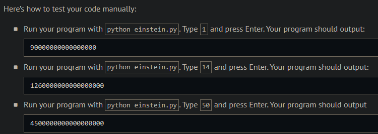
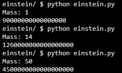
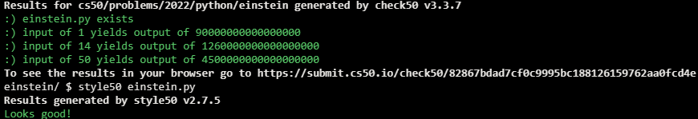

# Einstein

## Problem Description

Even if you haven’t studied physics (recently or ever!), you might have heard that $E = mc^2$, wherein $E$ represents energy (measured in Joules), $m$ represents mass (measured in kilograms), and $c$ represents the speed of light (measured approximately as 300000000 meters per second), per Albert Einstein et al. Essentially, the formula means that mass and energy are equivalent.

In a file called einstein.py, implement a program in Python that prompts the user for mass as an integer (in kilograms) and then outputs the equivalent number of Joules as an integer. Assume that the user will input an integer.

## My solution

```python
def main():
    c = 300000000
    mass = int(input("Mass: "))
    print(mass * pow(c, 2))
```

## Output Expected



## Output Obtained



## Score



## Usage

1. Run 'python einstein.py' on your command line and follow the prompt.