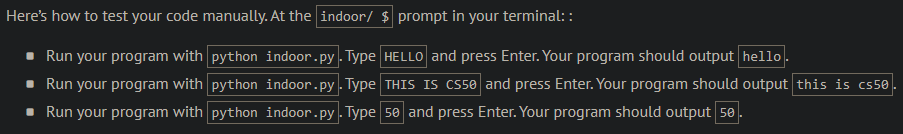
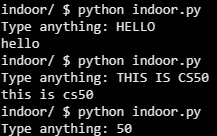
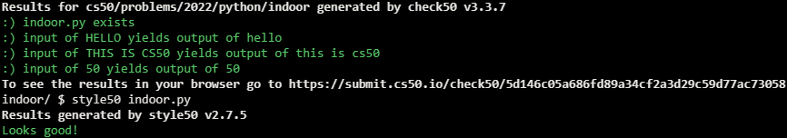

# Indoor Voice

## Problem Description

WRITING IN ALL CAPS IS LIKE YELLING.

Best to use your “indoor voice” sometimes, writing entirely in lowercase.

In a file called indoor.py, implement a program in Python that prompts the user for input and then outputs that same input in lowercase. Punctuation and whitespace should be outputted unchanged. You’re welcome, but not required, to prompt the user explicitly, as by passing a str of your own as an argument to input.

## My solution

```python
def main():
    text = input("Type anything: ")
    print(text.lower())
```

## Output Expected



## Output Obtained



## Score



## Usage

1. Run 'python indoor.py' on your command line and follow the prompt.