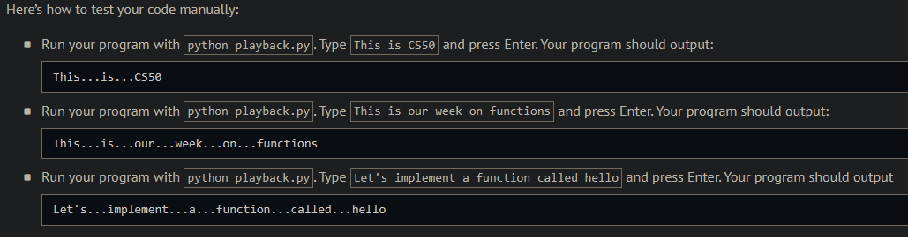
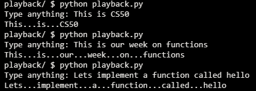
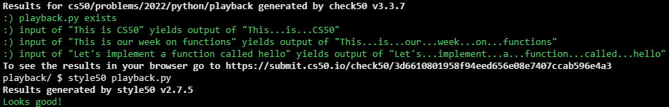

# Playback

## Problem Description

Some people have a habit of lecturing speaking rather quickly, and it’d be nice to slow them down, a la YouTube’s 0.75 playback speed, or even by having them pause between words.

In a file called playback.py, implement a program in Python that prompts the user for input and then outputs that same input, replacing each space with ... (i.e., three periods).

## My solution

```python
def main():
    text = input("Type anything: ")
    print(text.replace(' ', '...'))
```

## Output Expected



## Output Obtained



## Score



## Usage

1. Run 'python playback.py' on your command line and follow the prompt.