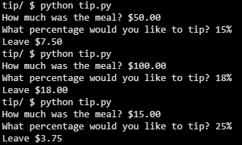

# Tip Calculator

## Problem Description

In the United States, it’s customary to leave a tip for your server after dining in a restaurant, typically an amount equal to 15% or more of your meal’s cost. Not to worry, though, we’ve written a tip calculator for you, below!

```python
def main():
    dollars = dollars_to_float(input("How much was the meal? "))
    percent = percent_to_float(input("What percentage would you like to tip? "))
    tip = dollars * percent
    print(f"Leave ${tip:.2f}")


def dollars_to_float(d):
    # TODO


def percent_to_float(p):
    # TODO


main()
```

Well, we’ve written most of a tip calculator for you. Unfortunately, we didn’t have time to implement two functions:

- dollars_to_float, which should accept a str as input (formatted as $##.##, wherein each # is a decimal digit), remove the leading $, and return the amount as a float. For instance, given $50.00 as input, it should return 50.0.
- percent_to_float, which should accept a str as input (formatted as ##%, wherein each # is a decimal digit), remove the trailing %, and return the percentage as a float. For instance, given 15% as input, it should return 0.15.
Assume that the user will input values in the expected formats.

## My solution

- dollars_to_float:
```python
def dollars_to_float(d):
    """Removes '$' symbol from string and returns it as a float"""
    return float(d.replace('$', ''))
```

- percent_to_float:
```python
def percent_to_float(p):
    """Removes '%' symbol from string and returns it as float"""
    return float(p.replace('%', '')) / 100
```

## Output Expected


## Output Obtained



## Score


## Usage

1. Run 'python tip.py' on your command line and follow the prompt.