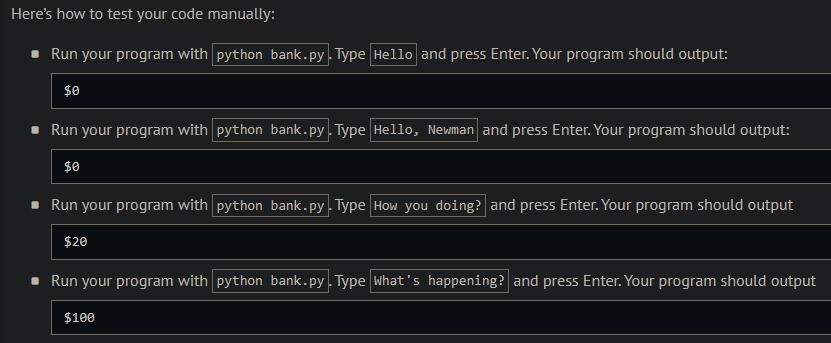
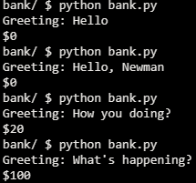
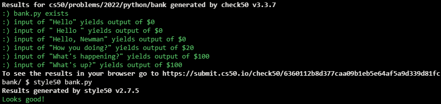

# Home Federal Savings Bank

## Problem Description

In season 7, episode 24 of Seinfeld, Kramer visits a bank that promises to give $100 to anyone who isn’t greeted with a “hello.” Kramer is instead greeted with a “hey,” which he insists isn’t a “hello,” and so he asks for $100. The bank’s manager proposes a compromise: “You got a greeting that starts with an ‘h,’ how does $20 sound?” Kramer accepts.

In a file called bank.py, implement a program that prompts the user for a greeting. If the greeting starts with “hello”, output $0. If the greeting starts with an “h” (but not “hello”), output $20. Otherwise, output $100. Ignore any leading whitespace in the user’s greeting, and treat the user’s greeting case-insensitively.

## My solution

```python
def main():
    greeting = input("Greeting: ").strip().lower()[0:5]

    if greeting == "hello":
        score = 0
    elif greeting[0] == "h":
        score = 20
    else:
        score = 100

    print(f'${score}')
```

## Output Expected



## Output Obtained



## Score



## Usage

1. Run 'python bank.py' on your command line and follow the prompt.