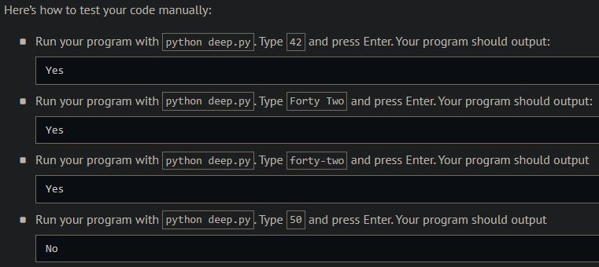

# Deep Thought

## Problem Description

```
“All right,” said the computer, and settled into silence again. The two men fidgeted. The tension was unbearable.
“You’re really not going to like it,” observed Deep Thought.
“Tell us!”
“All right,” said Deep Thought. “The Answer to the Great Question…”
“Yes…!”
“Of Life, the Universe and Everything…” said Deep Thought.
“Yes…!”
“Is…” said Deep Thought, and paused.
“Yes…!”
“Is…”
“Yes…!!!…?”
“Forty-two,” said Deep Thought, with infinite majesty and calm.”

— The Hitchhiker’s Guide to the Galaxy, Douglas Adams
```

In deep.py, implement a program that prompts the user for the answer to the Great Question of Life, the Universe and Everything, outputting Yes if the user inputs 42 or (case-insensitively) forty-two or forty two. Otherwise output No.

## My solution

```python
def main():
    ans = input("What's the answer to the Great Question of Life, the Universe and Everything? ").lower().strip()
    if ans == '42' or ans == 'forty-two' or ans == 'forty two':
        print('Yes')
    else:
        print('No')
```

## Output Expected



## Output Obtained


## Score


## Usage

1. Run 'python deep.py' on your command line and follow the prompt.