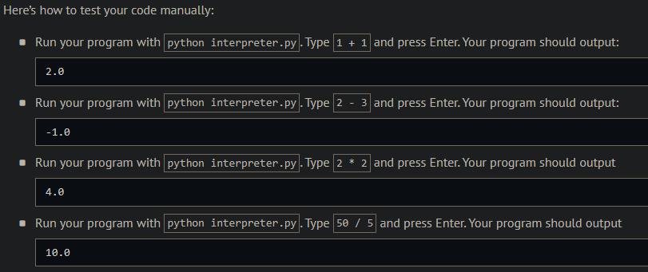
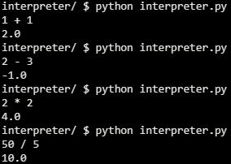

# Math Interpreter

## Problem Description

Python already supports math, whereby you can write code to add, subtract, multiply, or divide values and even variables. But let’s write a program that enables users to do math, even without knowing Python.

In a file called interpreter.py, implement a program that prompts the user for an arithmetic expression and then calculates and outputs the result as a floating-point value formatted to one decimal place. Assume that the user’s input will be formatted as x y z, with one space between x and y and one space between y and z, wherein:

- x is an integer
- y is +, -, *, or /
- z is an integer


For instance, if the user inputs 1 + 1, your program should output 2.0. Assume that, if y is /, then z will not be 0.

Note that, just as python itself is an interpreter for Python, so will your interpreter.py be an interpreter for math!

## My solution

```python
def main():
    op = input("Input: ")

    x, y, z = op.split(' ')

    match y:
        case '+':
            print(f'{(float(x) + float(z)):.1f}')
        case '-':
            print(f'{(float(x) - float(z)):.1f}')
        case '*':
            print(f'{(float(x) * float(z)):.1f}')
        case '/':
            print(f'{(float(x) / float(z)):.1f}')
```

## Output Expected



## Output Obtained



## Score


## Usage

1. Run 'python interpreter.py' on your command line and follow the prompt.