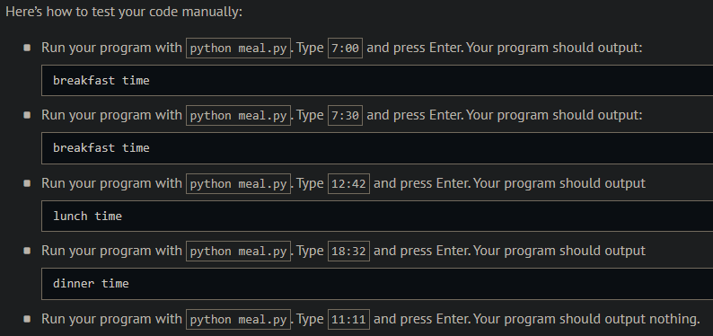
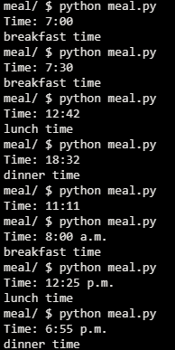
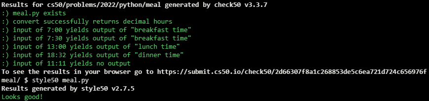

# Meal Time

## Problem Description

Suppose that you’re in a country where it’s customary to eat breakfast between 7:00 and 8:00, lunch between 12:00 and 13:00, and dinner between 18:00 and 19:00. Wouldn’t it be nice if you had a program that could tell you what to eat when?

In meal.py, implement a program that prompts the user for a time and outputs whether it’s breakfast time, lunch time, or dinner time. If it’s not time for a meal, don’t output anything at all. Assume that the user’s input will be formatted in 24-hour time as #:## or ##:##. And assume that each meal’s time range is inclusive. For instance, whether it’s 7:00, 7:01, 7:59, or 8:00, or anytime in between, it’s time for breakfast.

Structure your program per the below, wherein convert is a function (that can be called by main) that converts time, a str in 24-hour format, to the corresponding number of hours as a float. For instance, given a time like "7:30" (i.e., 7 hours and 30 minutes), convert should return 7.5 (i.e., 7.5 hours).

```python
def main():
    ...


def convert(time):
    ...


if __name__ == "__main__":
    main()
```

## Challenge

If up for a challenge, optionally add support for 12-hour times, allowing the user to input times in these formats too:

- #:## a.m. and ##:## a.m.
- #:## p.m. and ##:## p.m.

## My solution

- main:

```python
def main():
    time = input("Time: ")

    time = convert(time)

    if 7 <= time <= 8:
        print("breakfast time")
    elif 12 <= time <= 13:
        print("lunch time")
    elif 18 <= time <= 19:
        print("dinner time")
```

- convert:
```python
def convert(time):
    """Convers time into an appropriate float value"""

    #Separate the hour and minutes elements from time
    hour, mins = time.split(':')
    hour = float(hour)

    # Is time in the 12-hour format?
    twelve_h = mins.find(' ')
    if twelve_h != -1:

        # Is it am or pm?
        ampm = mins[twelve_h + 1:]
        mins = mins[0:twelve_h]

        # If its pm and the hour isn't 12, add 12 to it
        if ampm == 'p.m.' and hour != 12.0:
            hour += 12

    # Re-scales minutes to fit between 0 and 1
    mins = float(mins) / 60
    return (hour + mins)
```

## Output Expected



## Output Obtained



## Score



## Usage

1. Run 'python meal.py' on your command line and follow the prompt.