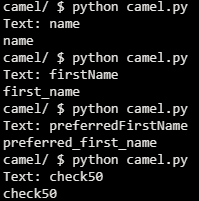
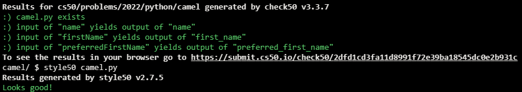

# CamelCase

## Problem Description

In some languages, it’s common to use camel case (otherwise known as “mixed case”) for variables’ names when those names comprise multiple words, whereby the first letter of the first word is lowercase but the first letter of each subsequent word is uppercase. For instance, whereas a variable for a user’s name might be called name, a variable for a user’s first name might be called firstName, and a variable for a user’s preferred first name (e.g., nickname) might be called preferredFirstName.

Python, by contrast, recommends snake case, whereby words are instead separated by underscores (_), with all letters in lowercase. For instance, those same variables would be called name, first_name, and preferred_first_name, respectively, in Python.

In a file called camel.py, implement a program that prompts the user for the name of a variable in camel case and outputs the corresponding name in snake case. Assume that the user’s input will indeed be in camel case.

## My solution

```python
def snake_case(text):
    """Returns text as snake case"""

    # Copy of text to return
    new = ""

    # Iterate over text, if char is uppercase,
    # append it as undercase following an underscore,
    # otherwise just append it
    for char in text:
        if char.isupper():
            new += f'_{char.lower()}'
        else:
            new += char
    return new
```

## Output Expected


## Output Obtained



## Score



## Usage

1. Run 'python camel.py' on your command line and follow the prompt.