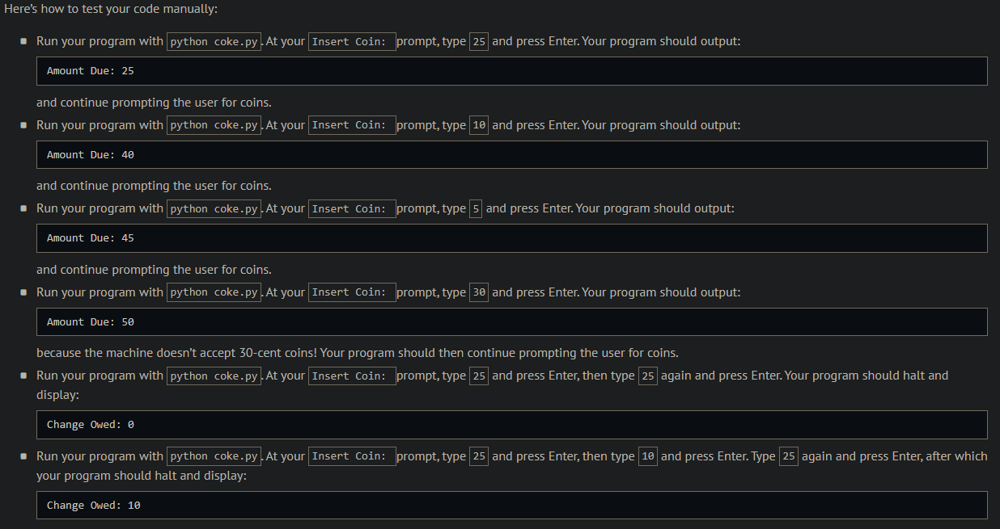
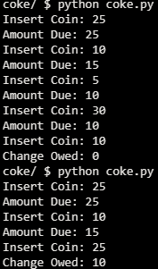
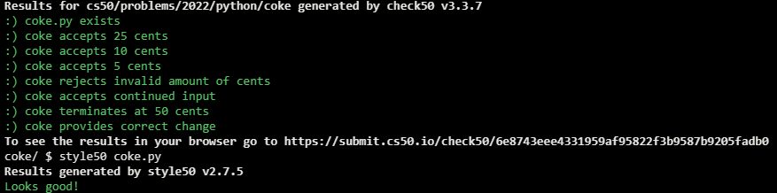

# Coke Machine

## Problem Description

Suppose that a machine sells bottles of Coca-Cola (Coke) for 50 cents and only accepts coins in these denominations: 25 cents, 10 cents, and 5 cents.

In a file called coke.py, implement a program that prompts the user to insert a coin, one at a time, each time informing the user of the amount due. Once the user has inputted at least 50 cents, output how many cents in change the user is owed. Assume that the user will only input integers, and ignore any integer that isn’t an accepted denomination.

## My solution

```python
def main():
    cost = 50

    # As long as the cost hasn't been covered...
    while cost > 0:
        coin = int(input("Insert Coin: "))

        # Ignore wrong amounts
        if coin not in [5, 10, 25]:
            coin = 0
            
        cost -= coin
        if cost > 0:
            print(f"Amount Due: {cost}")
    print(f"Change Owed: {cost * -1}")
```

## Output Example



## Output Obtained



## Score



## Usage

1. Run 'python coke.py' on your command line and follow the prompt.