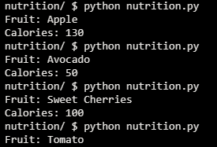

# Nutrition Facts

## Problem Description

The U.S. Food & Drug Adminstration (FDA) offers downloadable/printable posters that “show nutrition information for the 20 most frequently consumed raw fruits … in the United States. Retail stores are welcome to download the posters, print, display and/or distribute them to consumers in close proximity to the relevant foods in the stores.”

In a file called nutrition.py, implement a program that prompts consumers users to input a fruit (case-insensitively) and then outputs the number of calories in one portion of that fruit, per the FDA’s poster for fruits, which is also available as text. Capitalization aside, assume that users will input fruits exactly as written in the poster (e.g., strawberries, not strawberry). Ignore any input that isn’t a fruit.

## My solution

```python
fruits = {
    "Apple": 130,
    "Avocado": 50,
    "Banana": 110,
    "Cantaloupe": 50,
    "Grapefruit": 60,
    "Grapes": 90,
    "Honeydrew": 50,
    "Kiwifruit": 90,
    "Lemon": 15,
    "Lime": 20,
    "Nectarine": 60,
    "Orange": 80,
    "Peach": 60,
    "Pear": 100,
    "Pineapple": 50,
    "Plums": 70,
    "Strawberries": 50,
    "Sweet Cherries": 100,
    "Tangerine": 50,
    "Watermelon": 80
}


def main():
    fruit = input("Fruit: ").title()
    if fruit in fruits:
        print(f"Calories: {fruits[fruit]}")
```

## Output Expected


## Output Obtained



## Score


## Usage

1. Run 'python nutrition.py' on your command line and follow the prompt.