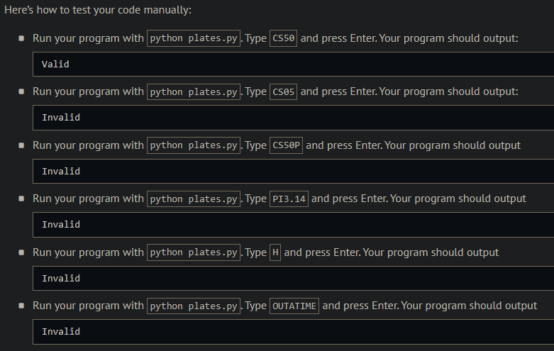
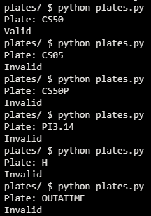
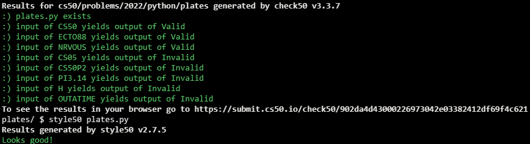

# Vanity Plates

## Problem Description

In Massachusetts, home to Harvard University, it’s possible to request a vanity license plate for your car, with your choice of letters and numbers instead of random ones. Among the requirements, though, are:

- Length must be between 2 and 6 characters
- Only letters and numbers allowed
- First 2 letters must be letters
- The first number to appear can't be a 0
- No letter may appear after a number

In plates.py, implement a program that prompts the user for a vanity plate and then output Valid if meets all of the requirements or Invalid if it does not. Assume that any letters in the user’s input will be uppercase. Structure your program per the below, wherein is_valid returns True if s meets all requirements and False if it does not. Assume that s will be a str. You’re welcome to implement additional functions for is_valid to call (e.g., one function per requirement).

```python
def main():
    plate = input("Plate: ")
    if is_valid(plate):
        print("Valid")
    else:
        print("Invalid")


def is_valid(s):
    ...


main()
```

## My solution

```python
def is_valid(s):
    """
    Validates s according to the rules above
    """
    nums = False  # Numbers flag
    if 2 <= len(s) <= 6:  # Length validation
        for char in s:
            if not char.isalnum():  # Only letters and numbers allowed
                return False
            if char.isalpha() and nums:  # No letters after numbers
                return False
            if not nums and char == '0':  # A 0 can't be the first number to appear
                return False
            if char.isdigit():  # A number has appeared
                nums = True
        return True
    return False
```

## Output Expected



## Output Obtained



## Score



## Usage

1. Run 'python plates.py' on your command line and follow the prompt.