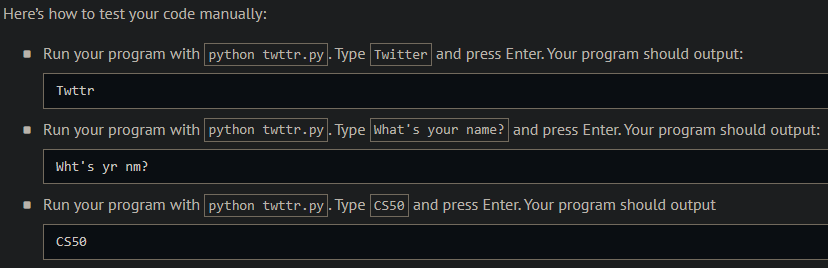
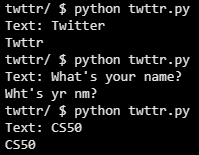
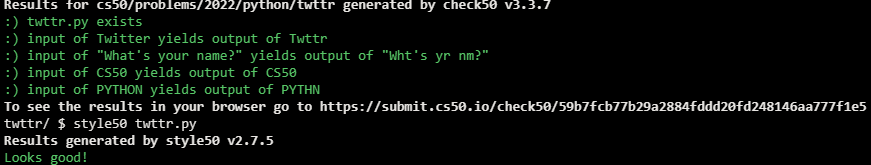

# Just setting up my twttr

## Problem Description

When texting or tweeting, it’s not uncommon to shorten words to save time or space, as by omitting vowels, much like Twitter was originally called twttr. In a file called twttr.py, implement a program that prompts the user for a str of text and then outputs that same text but with all vowels (A, E, I, O, and U) omitted, whether inputted in uppercase or lowercase.

## My solution

```python
def main():
    text = input("Text: ")
    vowels = ['a', 'e', 'i', 'o', 'u']

    new = ""
    for char in text:
        if char.lower() not in vowels:
            new += char
    print(new)
```

## Output Expected



## Output Obtained



## Score



## Usage

1. Run 'python twttr.py' on your command line and follow the prompt.