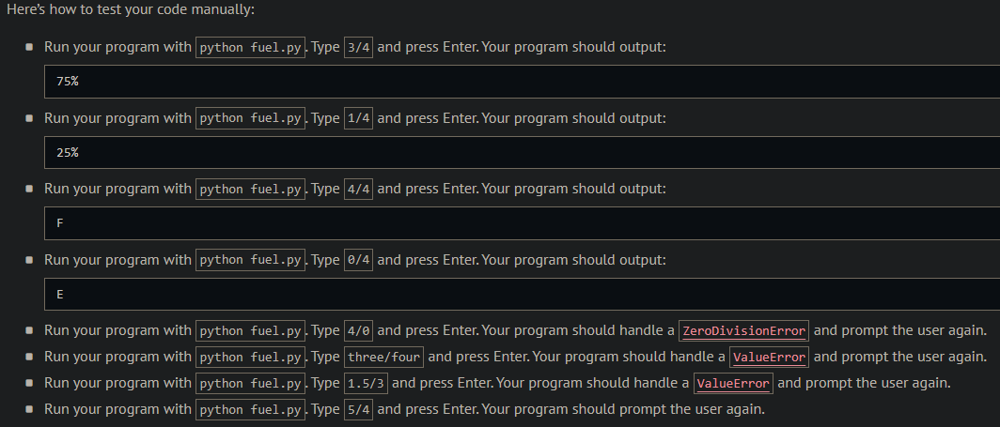
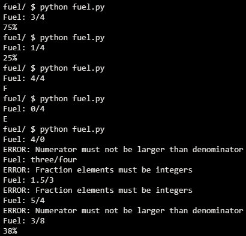
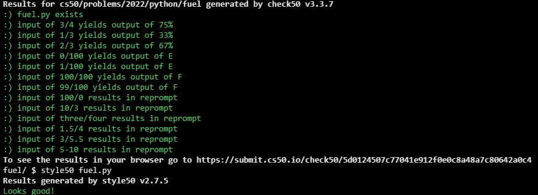

# Fuel Gauge

## Problem Description

Fuel gauges indicate, often with fractions, just how much fuel is in a tank. For instance 1/4 indicates that a tank is 25% full, 1/2 indicates that a tank is 50% full, and 3/4 indicates that a tank is 75% full.

In a file called fuel.py, implement a program that prompts the user for a fraction, formatted as X/Y, wherein each of X and Y is an integer, and then outputs, as a percentage rounded to the nearest integer, how much fuel is in the tank. If, though, 1% or less remains, output E instead to indicate that the tank is essentially empty. And if 99% or more remains, output F instead to indicate that the tank is essentially full.

If, though, X or Y is not an integer, X is greater than Y, or Y is 0, instead prompt the user again. (It is not necessary for Y to be 4.) Be sure to catch any exceptions like ValueError or ZeroDivisionError.

## My solution

```python
def main():
    fuel = frac_to_dec("Fuel: ")
    fuel = round(fuel * 100)

    # Print appropriate value
    if fuel <= 1:
        print("E")
    elif fuel >= 99:
        print("F")
    else:
        print(f"{fuel}%")


def frac_to_dec(prompt):
    """Ask user for a fraction and return it as decimal"""
    while True:
        frac = input(prompt)
        try:
            x, y = frac.split('/')
        except:
            print("ERROR: Please enter a fraction (x/y)")
        else:
            try:
                x = int(x)
                y = int(y)
            except ValueError:
                print("ERROR: Fraction elements must be integers")
            else:
                if x > y:
                    print("ERROR: Numerator must not be larger than denominator")
                    continue
                try:
                    return x / y
                except ZeroDivisionError:
                    print("ERROR: Denominator can't be 0")
```

## Output Expected



## Output Obtained



## Score



## Usage

1. Run 'python fuel.py' on your command line and follow the prompt.