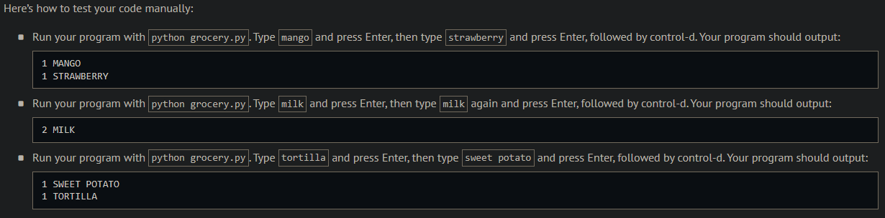
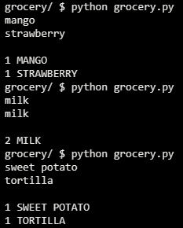
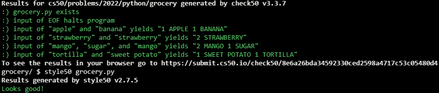

# Grocery List

## Problem Description

### Background

Suppose that you’re in the habit of making a list of items you need from the grocery store.

In a file called grocery.py, implement a program that prompts the user for items, one per line, until the user inputs control-d (which is a common way of ending one’s input to a program). Then output the user’s grocery list in all uppercase, sorted alphabetically by item, prefixing each line with the number of times the user inputted that item. No need to pluralize the items. Treat the user’s input case-insensitively.

## My solution

Defined a 'sort_dict_key' function to sort a dictionary alphabetically by key

```python
def main():
    list = {}

    # Get item(s) from user
    while True:
        try:
            item = input()
        except EOFError:
            print()
            break
        else:
            if item in list:
                list[item] += 1
            else:
                list[item] = 1

    # Sort the dictionary 'list' alphabeticaly by key
    list = sort_dict_keys(list)

    # Print items
    for item in list:
        print(f"{list[item]} {item.upper()}")
```

sort_dict_key:

```python
def sort_dict_keys(dict):
    """Sorts a dictionary by keys"""
    keys = list(dict.keys())
    keys.sort()
    sorted_dict = {i: dict[i] for i in keys}
    return sorted_dict
```

## Output Expected



## Output Obtained



## Score



## Usage

1. Run 'python grocery.py' on your command line.
2. Type items on at a time
3. When done click ctrl + d