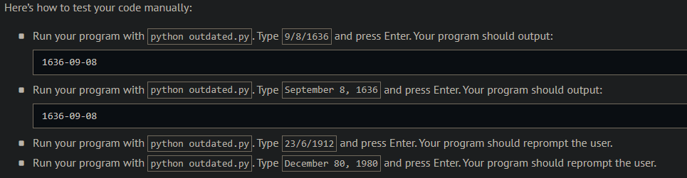
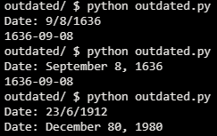
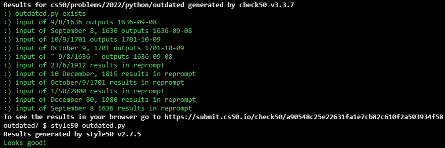

# Outdated

## Problem Description

Suppose that you’re in the habit of making a list of items you need from the grocery store.

In a file called grocery.py, implement a program that prompts the user for items, one per line, until the user inputs control-d (which is a common way of ending one’s input to a program). Then output the user’s grocery list in all uppercase, sorted alphabetically by item, prefixing each line with the number of times the user inputted that item. No need to pluralize the items. Treat the user’s input case-insensitively.

```python
[
    "January",
    "February",
    "March",
    "April",
    "May",
    "June",
    "July",
    "August",
    "September",
    "October",
    "November",
    "December"
]
```

Then output that same date in YYYY-MM-DD format. If the user’s input is not a valid date in either format, prompt the user again. Assume that every month has no more than 31 days; no need to validate whether a month has 28, 29, 30, or 31 days.

## My solution

Defined a 'sort_dict_key' function to sort a dictionary alphabetically by key

```python
def main():
def valid_date(date):
    """
    Gets a middle-endian date(month/day/year) and returns an ISO-8601(year-month-day) one

    Supports the following formats:
    - ##/##/####
    - #/#/####
    - ##/#/####
    - #/##/####
    - month #, year
    - month ##, year
    """
    try:
        month, day, year = date.split('/')
    except:
        try:
            month, day, year = date.split(' ')
        except:
            return 0
        if date.find(',') == -1:
            return 0

        # Day validation
        try:
            day = day.split(',')[0]
        except:
            return 0
        try:
            day = int(day)
        except:
            return 0
        if 1 <= day <= 31:

            # Day formatting
            if day < 10:
                day = '0' + str(day)
            else:
                day = str(day)
        else:
            return 0

        # Month validation
        try:
            month = months[month]
        except:
            return 0
        if 1 <= month <= 12:

            # Month formatting
            if month < 10:
                month = '0' + str(month)
            else:
                month = str(month)

            # Returns date
            return f"{year}-{month}-{day}"
        else:
            return 0

    # Day validation
    try:
        day = int(day)
    except:
        return 0
    if 1 <= day <= 31:

        # Day formatting
        if day < 10:
            day = '0' + str(day)
        else:
            day = str(day)
    else:
        return 0

    # Month validation
    try:
        month = int(month)
    except:
        return 0
    if 1 <= month <= 12:
        if month < 10:

            # Month formatting
            month = '0' + str(month)
        else:
            month = str(month)

        # Return date
        return f"{year}-{month}-{day}"
    else:
        return 0
```

## Output Expected



## Output Obtained



## Score



## Usage

1. Run 'python outdated.py' and follow the prompt.