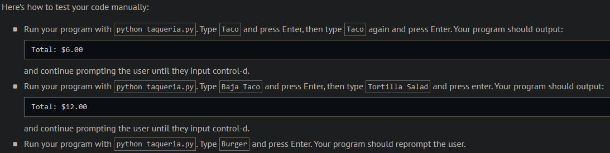
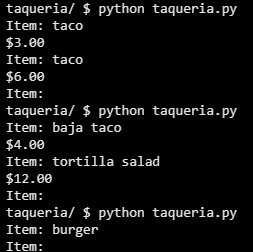
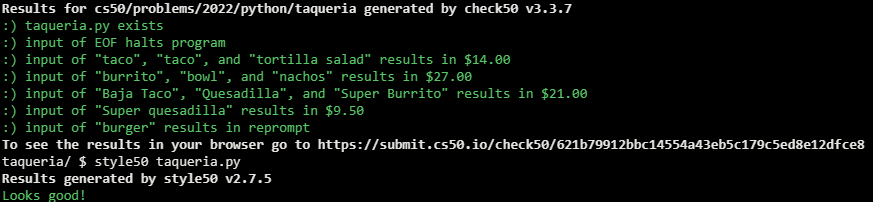

# Felipe's Taqueria

## Problem Description

### Background

One of the most popular places to eat in Harvard Square is Felipe’s Taqueria, which offers a menu of entrees, per the dict below, wherein the value of each key is a price in dollars:

```python
{
    "Baja Taco": 4.00,
    "Burrito": 7.50,
    "Bowl": 8.50,
    "Nachos": 11.00,
    "Quesadilla": 8.50,
    "Super Burrito": 8.50,
    "Super Quesadilla": 9.50,
    "Taco": 3.00,
    "Tortilla Salad": 8.00
}
```
In a file called taqueria.py, implement a program that enables a user to place an order, prompting them for items, one per line, until the user inputs control-d (which is a common way of ending one’s input to a program). After each inputted item, display the total cost of all items inputted thus far, prefixed with a dollar sign ($) and formatted to two decimal places. Treat the user’s input case insensitively. Ignore any input that isn’t an item. Assume that every item on the menu will be titlecased.

## My solution

```python
def main():
    total = 0.0
    while (True):
        try:
            item = input("Item: ")
            item = item.title()  # Sets item to titlecase
            if item in menu:
                total += menu[item]
                print(f'${total:.2f}')

        # If user types ctrl + d
        except EOFError:
            print()
            break
```

## Output Expected



## Output Obtained



## Score



## Usage

1. Run 'python taqueria.py' on your command line and follow the prompt.