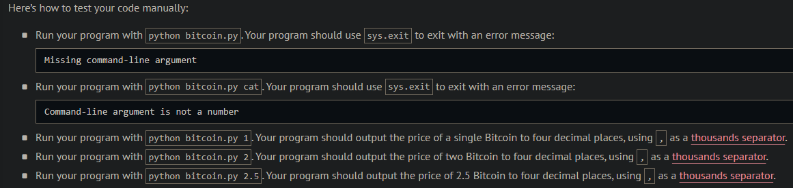
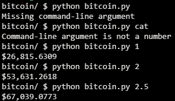
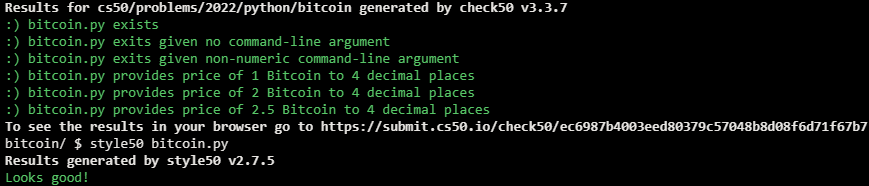

# Bitcoin Price Index

## Problem Description

Bitcoin is a form of digitial currency, otherwise known as cryptocurrency. Rather than rely on a central authority like a bank, Bitcoin instead relies on a distributed network, otherwise known as a blockchain, to record transactions.

Because there’s demand for Bitcoin (i.e., users want it), users are willing to buy it, as by exchanging one currency (e.g., USD) for Bitcoin.

In a file called bitcoin.py, implement a program that:

- Expects the user to specify as a command-line argument the number of Bitcoins, $n$, that they would like to buy. If that argument cannot be converted to a float, the program should exit via sys.exit with an error message.
- Queries the API for the CoinDesk Bitcoin Price Index at https://api.coindesk.com/v1/bpi/currentprice.json, which returns a JSON object, among whose nested keys is the current price of Bitcoin as a float. Be sure to catch any exceptions, as with code like:

```python
import requests

try:
    ...
except requests.RequestException:
    ...
```

- Outputs the current cost of  $n$ Bitcoins in USD to four decimal places, using , as a thousands separator.

## My solution

### Description


```python
import sys
import requests


def main():

    # Validate command-line argument
    if len(sys.argv) != 2:
        sys.exit("Missing command-line argument")
    try:
        amount = float(sys.argv[1])
    except:
        sys.exit("Command-line argument is not a number")

    # Get data from coindesk's API
    try:
        price = requests.get('https://api.coindesk.com/v1/bpi/currentprice.json').json()['bpi']['USD']['rate_float']
    except requests.RequestException:
        sys.exit("Something went wrong")

    # Print total price of requested info
    total = price * amount
    print(f'${total:,.4f}')
```

## Output Expected



## Output Obtained



## Score



## Usage

1. Run 'python bitcoin.py $n$' on your command-line.