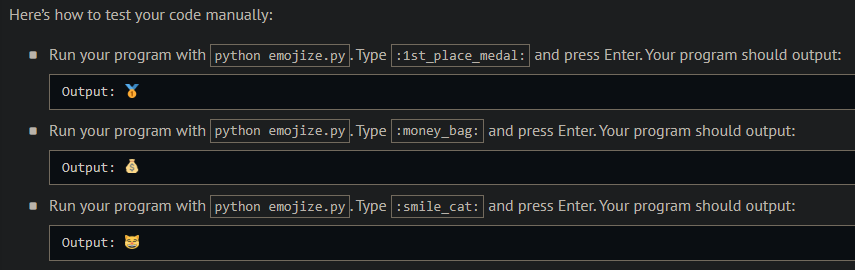
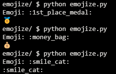
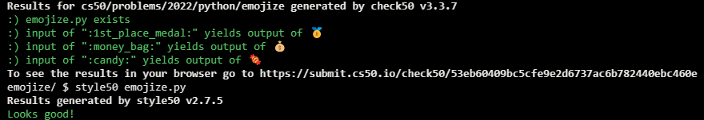

# Emojize

## Problem Description

Because emoji aren’t quite as easy to type as text, at least on laptops and desktops, some programs support “codes,” whereby you can type, for instance, :thumbs_up:, which will be automatically converted to 👍. Some programs additionally support aliases, whereby you can more succinctly type, for instance, :thumbsup:, which will also be automatically converted to 👍.

See carpedm20.github.io/emoji/all.html?enableList=enable_list_alias for a list of codes with aliases.

In a file called emojize.py, implement a program that prompts the user for a str in English and then outputs the “emojized” version of that str, converting any codes (or aliases) therein to their corresponding emoji.

## My solution

Defined a 'sort_dict_key' function to sort a dictionary alphabetically by key

```python
import emoji


def main():
    emj = input("Emoji: ")
    print(emoji.emojize(f'{emj}'))
```

## Output Expected



## Output Obtained



## Score



## Usage

1. Run 'python emojize.py' and follow the prompt.