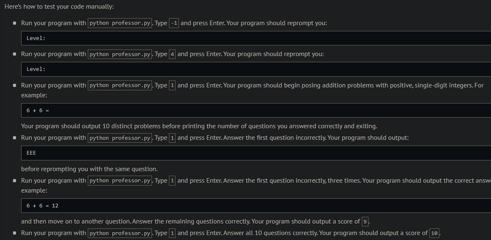
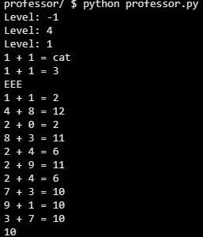
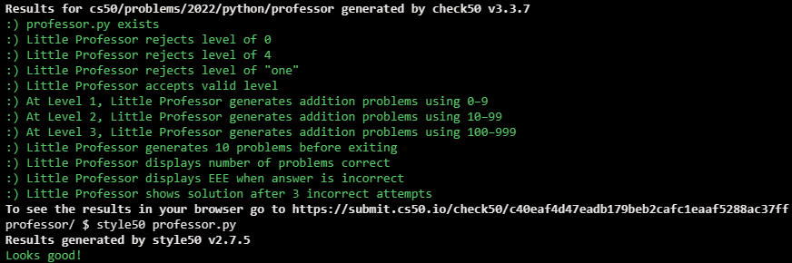

# Little Professor

## Problem Description

One of David’s first toys as a child, funny enough, was Little Professor, a “calculator” that would generate ten different math problems for David to solve. For instance, if the toy were to display 4 + 0 = , David would (hopefully) answer with 4. If the toy were to display 4 + 1 = , David would (hopefully) answer with 5. If David were to answer incorrectly, the toy would display EEE. And after three incorrect answers for the same problem, the toy would simply display the correct answer (e.g., 4 + 0 = 4 or 4 + 1 = 5).

In a file called professor.py, implement a program that:

Prompts the user for a level, 
- If the user does not input 1, 2, or 3, the program should prompt again.
- Randomly generates ten (10) math problems formatted as X + Y = , wherein each of X and Y is a non-negative integer with 
 digits. No need to support operations other than addition (+).
- Prompts the user to solve each of those problems. If an answer is not correct (or not even a number), the program should output EEE and prompt the user again, allowing the user up to three tries in total for that problem. If the user has still not answered correctly after three tries, the program should output the correct answer.
- The program should ultimately output the user’s score: the number of correct answers out of 10.
Structure your program as follows, wherein get_level prompts (and, if need be, re-prompts) the user for a level and returns 1, 2, or 3, and generate_integer returns a randomly generated non-negative integer with level digits or raises a ValueError if level is not 1, 2, or 3:

```python
import random


def main():
    ...


def get_level():
    ...


def generate_integer(level):
    ...


if __name__ == "__main__":
    main()
```

## My solution

### Description


```python
from random import randint


def main():
    score = 0

    n = get_level()

    # Plays the match (10 rounds)
    for i in range(10):
        op1, op2, result = generate_addition(n)

        score += play_round(op1, op2, result)

    print(f'{score}')


def get_level():
    """Returns an int between 1 and 3 (inclusive)"""
    while True:
        # Gets int
        try:
            n = int(input("Level: "))
        except ValueError:
            continue

        # Makes sure its a valid int
        if n in [1, 2, 3]:
            break

    return n


def generate_integer(level):
    """Returns an integer of 'level' digits"""

    if level not in [1, 2, 3]:
        raise ValueError("ERROR: Level must be either 1, 2, or 3.")

    # 1-digit integer
    if level == 1:
        return randint(0, 9)

    # 2-digit integer
    if level == 2:
        return randint(10, 99)

    # 3-digit integer
    return randint(100, 999)


def generate_addition(level):
    """
    Generates 2 'level'-digit integers
    Returns them and the result of their addition
    """
    op1 = generate_integer(level)
    op2 = generate_integer(level)
    result = op1 + op2
    return op1, op2, result


def play_round(op1, op2, result):
    """
    1 round of the match
    3 chances
    """

    chances = 3

    while True:

        # Get an int as a guess
        try:
            guess = int(input(f"{op1} + {op2} = "))
        except:
            continue

        # Correct guess
        if guess == result:
            return 1

        # Incorrect guess
        print("EEE")
        chances -= 1

        # Ran out of chances
        if chances == 0:
            print(result)
            return 0


if __name__ == "__main__":
    main()
```

## Output Expected



## Output Obtained



## Score



## Usage

1. Run 'python professor.py' and follow the prompt.