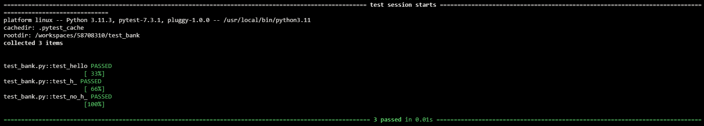
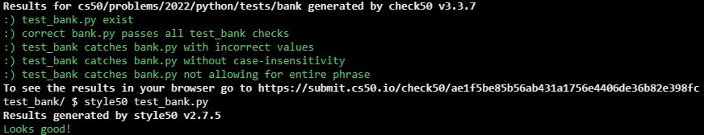

# Back to the Bank

## Problem Description

In a file called bank.py, reimplement Home Federal Savings Bank from Problem Set 1, restructuring your code per the below, wherein value expects a str as input and returns 0 if that str starts with “hello”, 20 if that str starts with an “h” (but not “hello”), or 100 otherwise, treating the str case-insensitively. You can assume that the string passed to the value function will not contain any leading spaces. Only main should call print.

```python
def main():
    ...


def value(greeting):
    ...


if __name__ == "__main__":
    main()
```

Then, in a file called test_bank.py, implement three or more functions that collectively test your implementation of value thoroughly, each of whose names should begin with test_ so that you can execute your tests with:

```
pytest test_bank.py
```

## My solution

### Description

- Test-oriented bank.py

```python
def main():
    greeting = input("Greeting: ")

    print(f'${value(greeting)}')


def value(greeting):
    """ Return a score based on greeting"""
    greeting = greeting.strip().lower()[0:5]

    if greeting == "hello":
        return 0
    elif greeting[0] == "h":
        return 20
    return 100


if __name__ == "__main__":
    main()
```

- test_bank.py

```python
from bank import value


# Hello as greeting
def test_hello():
    assert value('Hello, David') == 0


# hi as greeting
def test_h_():
    assert value('hi, David') == 20


# sup as greeting
def test_no_h_():
    assert value('sup, David') == 100
```

## Test Results



## Score



## Usage

1. Run 'pytest test_bank.py' on your command-line.