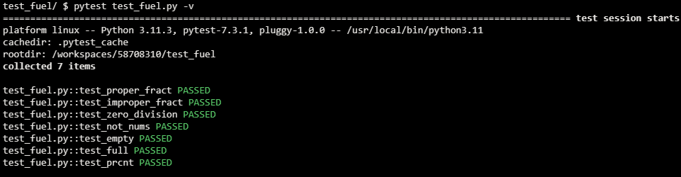
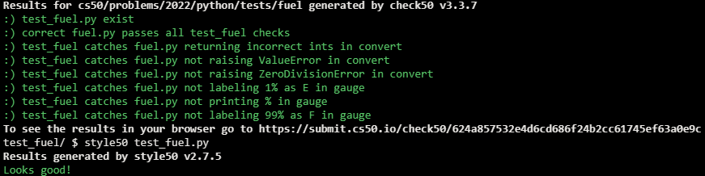

# Refuel

## Problem Description

In a file called fuel.py, reimplement Fuel Gauge from Problem Set 3, restructuring your code per the below, wherein:

- convert expects a str in X/Y format as input, wherein each of X and Y is an integer, and returns that fraction as a percentage rounded to the nearest int between 0 and 100, inclusive. If X and/or Y is not an integer, or if X is greater than Y, then convert should raise a ValueError. If Y is 0, then convert should raise a ZeroDivisionError.
- gauge expects an int and returns a str that is:
  - "E" if that int is less than or equal to 1,
  - "F" if that int is greater than or equal to 99,
  - and "Z%" otherwise, wherein Z is that same int.

```python
def main():
    ...


def convert(fraction):
    ...


def gauge(percentage):
    ...


if __name__ == "__main__":
    main()
```

Then, in a file called test_fuel.py, implement two or more functions that collectively test your implementations of convert and gauge thoroughly, each of whose names should begin with test_ so that you can execute your tests with:

```
pytest test_fuel.py
```

## My solution

### Description

- Test-oriented fuel.py

```python
def convert(fraction):
    """Gets a string in x/y format and returns it as a percentage value"""

    # String is properly formatted
    try:
        x, y = fraction.split('/')
    except ValueError:
        raise ValueError

    # Both elements are ints
    try:
        x = int(x)
        y = int(y)
    except ValueError:
        raise ValueError

    # ZeroDivision
    if y == 0:
        raise ZeroDivisionError

    # Improper fraction
    if x > y:
        raise ValueError

    prcnt = x / y
    return round(prcnt * 100)


def gauge(percentage):
    """Returns fuel value to display"""

    # Empty
    if percentage <= 1:
        return 'E'

    # Full
    elif percentage >= 99:
        return 'F'

    # Percentage
    else:
        return f'{percentage}%'
```

- test_fuel.py

```python
from fuel import convert, gauge
from pytest import raises


# Proper fraction
def test_proper_fract():
    assert convert('1/2') == 50
    assert convert('4/5') == 80


# Improper fraction
def test_improper_fract():
    with raises(ValueError):
        convert('2/1')


# Zero Division
def test_zero_division():
    with raises(ZeroDivisionError):
        convert('5/0')


# Elements aren't ints
def test_not_nums():
    with raises(ValueError):
        convert('a/b')


# Tank is empty
def test_empty():
    assert gauge(0) == 'E'
    assert gauge(1) == 'E'


# Tank is full
def test_full():
    assert gauge(99) == 'F'
    assert gauge(100) == 'F'


# Tank isn't full but has got fuel
def test_prcnt():
    assert gauge(1.01) == '1.01%'
    assert gauge(50) == '50%'
    assert gauge(89.99) == '89.99%'
```

## Test Results



## Score



## Usage

1. Run 'pytest test_fuel.py' on your command-line.