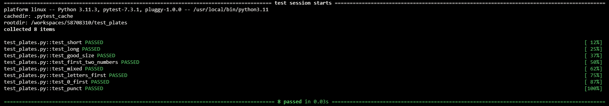
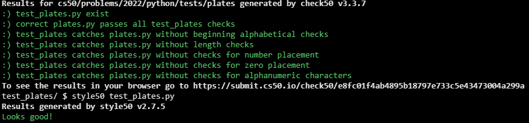

# Re-requesting a Vanity Plate

## Problem Description

In a file called plates.py, reimplement Vanity Plates from Problem Set 2, restructuring your code per the below, wherein is_valid still expects a str as input and returns True if that str meets all requirements and False if it does not, but main is only called if the value of __name__ is "__main__":

```python
def main():
    ...


def is_valid(s):
    ...


if __name__ == "__main__":
    main()
```

Then, in a file called test_plates.py, implement four or more functions that collectively test your implementation of is_valid thoroughly, each of whose names should begin with test_ so that you can execute your tests with:

```
pytest test_plates.py
```

## My solution

### Description

- Test-oriented plates.py

```python
def main():
    plate = input("Plate: ")
    if is_valid(plate):
        print("Valid")
    else:
        print("Invalid")


def is_valid(s):
    """
    Validates s according to the rules above
    """
    nums = False  # Numbers flag
    if 2 <= len(s) <= 6:  # Length validation
        for i, char in enumerate(s):
            if not char.isalnum():  # Only letters and numbers allowed
                return False
            if not char.isalpha() and i < 2:
                return False
            if char.isalpha() and nums:  # No letters after numbers
                return False
            if not nums and char == '0':  # A 0 can't be the first number to appear
                return False
            if char.isdigit():  # A number has appeared
                nums = True
        return True
    return False
```

- test_plates.py

```python
from plates import is_valid


# String too short
def test_short():
    assert is_valid('a') == False


# String too large
def test_long():
    assert is_valid('abcdefg') == False


# Proper string size
def test_good_size():
    assert is_valid('abcdef') == True


# Numbers amongst the first two characters
def test_first_two_numbers():
    assert is_valid('123456') == False


# Letters after numbers
def test_mixed():
    assert is_valid('ab12ef') == False


# Numbers only after letters
def test_letters_first():
    assert is_valid('ab1234') == True
    assert is_valid('abcde1') == True


# 0 is the first number to appear
def test_0_first():
    assert is_valid('abcd01') == False


# Punctuation
def test_punct():
    assert is_valid('ab,.!?') == False
    assert is_valid('abc12!') == False
```

## Test Results



## Score



## Usage

1. Run 'pytest test_plates.py' on your command-line.