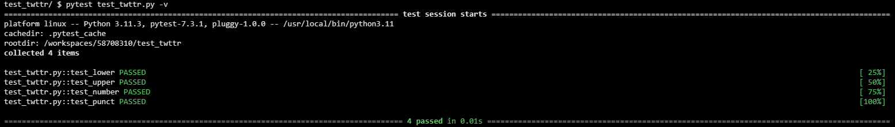
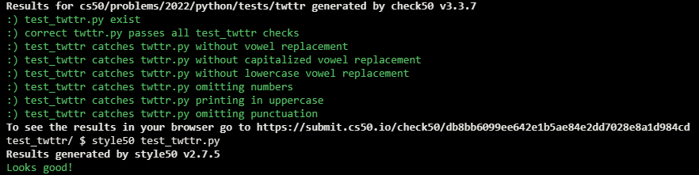

# Testing my twttr

## Problem Description

In a file called twttr.py, reimplement Setting up my twttr from Problem Set 2, restructuring your code per the below, wherein shorten expects a str as input and returns that same str but with all vowels (A, E, I, O, and U) omitted, whether inputted in uppercase or lowercase.

```python
def main():
    ...


def shorten(word):
    ...


if __name__ == "__main__":
    main()
```

Then, in a file called test_twttr.py, implement one or more functions that collectively test your implementation of shorten thoroughly, each of whose names should begin with test_ so that you can execute your tests with:

```
pytest test_twttr.py
```

## My solution

### Description

- Test-oriented twttr.py

```python
def main():
    text = input("Text: ")
    print(shorten(text))


def shorten(word):
    vowels = ['a', 'e', 'i', 'o', 'u']

    new = ""
    for char in word:
        if char.lower() not in vowels:
            new += char
    return new


if __name__ == "__main__":
    main()
```

- test_twttr.py:

```python
from twttr import shorten


# Test lowercase vowel replacement
def test_lower():
    assert shorten('hello') == 'hll'


# Test uppercase vowel replacement
def test_upper():
    assert shorten('HELLO') == 'HLL'


# Test numbers omition
def test_number():
    assert shorten('50') == '50'


# Test punctuation omition
def test_punct():
    assert shorten('!._?') == '!._?'
```

## Test Results



## Score



## Usage

1. Run 'pytest test_twttr.py' on your command-line.