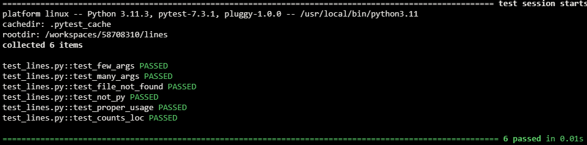
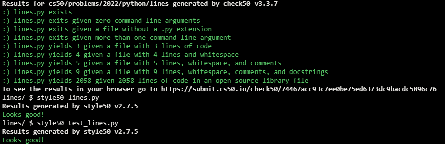

# Lines of Code

## Problem Description

One way to measure the complexity of a program is to count its number of lines of code (LOC), excluding blank lines and comments. For instance, a program like


```python
# Say hello

name = input("What's your name? ")
print(f"hello, {name}")
```

has just two lines of code, not four, since its first line is a comment, and its second line is blank (i.e., just whitespace). That’s not that many, so odds are the program isn’t that complex. Of course, just because a program (or even function) has more lines of code than another doesn’t necessarily mean it’s more complex. For instance, a function like

```python
def is_even(n):
    if n % 2 == 0:
        return True
    else:
        return False
```

isn’t really twice as complex as a function like

```python
def is_even(n):
    return n % 2 == 0
```

even though the former has (more than) twice as many lines of code. In fact, the former might arguably be simpler if it’s easier to read! So lines of code should be taken with a grain of salt.

Even so, in a file called lines.py, implement a program that expects exactly one command-line argument, the name (or path) of a Python file, and outputs the number of lines of code in that file, excluding comments and blank lines. If the user does not specify exactly one command-line argument, or if the specified file’s name does not end in .py, or if the specified file does not exist, the program should instead exit via sys.exit.

Assume that any line that starts with #, optionally preceded by whitespace, is a comment. (A docstring should not be considered a comment.) Assume that any line that only contains whitespace is blank.

## My solution

### Description

#### lines.py

```python
import sys
import os


def main():
    f = valid_py_file(sys.argv)

    print(count_loc(f))


def valid_py_file(argv):
    """Validates a python file passed as a command-line argument"""

    # Validates proper amount of command-line arguments (2)
    args = len(argv)
    if args < 2:
        sys.exit("Too few command-line arguments")
    if args > 2:
        sys.exit("Too many command-line arguments")

    f = argv[1]

    # Validates file exists
    if not os.path.isfile(f):
        sys.exit("File does not exist")

    # Validates file is a python one
    if f.split('.')[-1] != 'py':
        sys.exit("Not a Python file")

    # Valid python file
    return f


def count_loc(s):
    """Counts LOC in a file"""
    locs = 0

    with open(s, 'r') as file:
        for row in file:
            row = row.lstrip()

            # If its not an empty line
            if len(row) != 0:

                # If its not a comment (docstrings allowed)
                if not row.startswith('#'):
                    locs += 1
    return locs


if __name__ == '__main__':
    main()
```

#### test_lines.py

```python
from lines import valid_py_file, count_loc
from pytest import raises


# Too few arguments
def test_few_args():
    with raises(SystemExit):
        valid_py_file(['lines.py'])


# Too many arguments
def test_many_args():
    with raises(SystemExit):
        valid_py_file(['lines.py', 'one', 'two'])


# Inexistent file
def test_file_not_found():
    with raises(SystemExit):
        valid_py_file(['lines.py', 'missing.py'])


# Not a python file
def test_not_py():
    with raises(SystemExit):
        valid_py_file(['lines.py', 'dummy.txt'])


# Proper usage
def test_proper_usage():
    assert valid_py_file(['lines.py', 'dummy.py'])


# Counts LOC on a valid file
def test_counts_loc():
    assert count_loc('dummy.py') == 11
```

## Test Results



## Score



## Usage

1. Run 'python lines.py *python file* on your command-line.