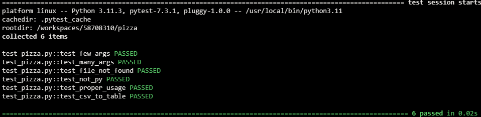
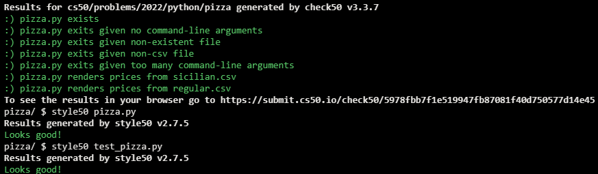

# Pizza Py

## Problem Description

Perhaps the most popular place for pizza in Harvard Square is Pinocchio’s Pizza & Subs, aka Noch’s, known for its Sicilian pizza, which is “a deep-dish or thick-crust pizza.”

Students tend to buy pizza by the slice, but Pinocchio’s also has whole pizzas on its menu too, per this CSV file of Sicilian pizzas, sicilian.csv, below:


```
Sicilian Pizza,Small,Large
Cheese,$25.50,$39.95
1 item,$27.50,$41.95
2 items,$29.50,$43.95
3 items,$31.50,$45.95
Special,$33.50,$47.95
```

See regular.csv for a CSV file of regular pizzas as well.

Of course, a CSV file isn’t the most customer-friendly format to look at. Prettier might be a table, formatted as ASCII art, like this one:

```
+------------------+---------+---------+
| Sicilian Pizza   | Small   | Large   |
+==================+=========+=========+
| Cheese           | $25.50  | $39.95  |
+------------------+---------+---------+
| 1 item           | $27.50  | $41.95  |
+------------------+---------+---------+
| 2 items          | $29.50  | $43.95  |
+------------------+---------+---------+
| 3 items          | $31.50  | $45.95  |
+------------------+---------+---------+
| Special          | $33.50  | $47.95  |
+------------------+---------+---------+
```

In a file called pizza.py, implement a program that expects exactly one command-line argument, the name (or path) of a CSV file in Pinocchio’s format, and outputs a table formatted as ASCII art using tabulate, a package on PyPI at pypi.org/project/tabulate. Format the table using the library’s grid format. If the user does not specify exactly one command-line argument, or if the specified file’s name does not end in .csv, or if the specified file does not exist, the program should instead exit via sys.exit.

## My solution

### Description

#### pizza.py

```python
import sys
import os

import csv
from tabulate import tabulate


def main():
    f = valid_csv_file(sys.argv)

    print(csv_to_table(f))


def valid_csv_file(argv):
    """Validates a csv file passed as a command-line argument"""

    # Validates proper amount of command-line arguments (2)
    args = len(argv)
    if args < 2:
        sys.exit("Too few command-line arguments")
    if args > 2:
        sys.exit("Too many command-line arguments")

    f = argv[1]

    # Validates file exists
    if not os.path.isfile(f):
        sys.exit("File does not exist")

    # Validates file extension
    if f.split('.')[-1] != 'csv':
        sys.exit(f"Not a .csv file")

    # Valid file
    return f


def csv_to_table(f):
    """Takes a csv file and returns it as an ASCII table"""
    with open(f, 'r') as file:
        reader = csv.reader(file)

        return tabulate(reader, headers='firstrow', tablefmt="grid")


if __name__ == '__main__':
    main()
```

#### test_pizza.py

```python
from pizza import valid_csv_file, csv_to_table
from pytest import raises


# Too few arguments
def test_few_args():
    with raises(SystemExit):
        valid_csv_file(['pizza.py'])


# Too many arguments
def test_many_args():
    with raises(SystemExit):
        valid_csv_file(['pizza.py', 'one', 'two'])


# Inexistent file
def test_file_not_found():
    with raises(SystemExit):
        valid_csv_file(['pizza.py', 'missing.py'])


# Not a python file
def test_not_py():
    with raises(SystemExit):
        valid_csv_file(['pizza.py', 'regular.txt'])


# Proper usage
def test_proper_usage():
    assert valid_csv_file(['pizza.py', 'regular.csv']) == 'regular.csv'


# Turns a csv into an ASCII table
def test_csv_to_table():
    assert csv_to_table('regular.csv') == '''+-----------------+---------+---------+
| Regular Pizza   | Small   | Large   |
+=================+=========+=========+
| Cheese          | $13.50  | $18.95  |
+-----------------+---------+---------+
| 1 topping       | $14.75  | $20.95  |
+-----------------+---------+---------+
| 2 toppings      | $15.95  | $22.95  |
+-----------------+---------+---------+
| 3 toppings      | $16.95  | $24.95  |
+-----------------+---------+---------+
| Special         | $18.50  | $26.95  |
+-----------------+---------+---------+'''
```

## Test Results



## Score



## Usage

1. Run 'python pizza.py *csv file* on your command-line.