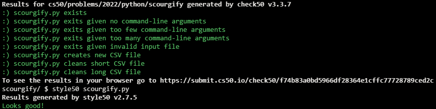

# Scourgify

## Problem Description

> “Ah, well,” said Tonks, slamming the trunk’s lid shut, “at least it’s all in. That could do with a bit of cleaning, too.” She pointed her wand at Hedwig’s cage. “Scourgify.” A few feathers and droppings vanished.
> 
> — Harry Potter and the Order of the Phoenix

Data, too, often needs to be “cleaned,” as by reformatting it, so that values are in a consistent, if not more convenient, format. Consider, for instance, this CSV file of students, before.csv, below:


```
name,house
"Abbott, Hannah",Hufflepuff
"Bell, Katie",Gryffindor
"Bones, Susan",Hufflepuff
"Boot, Terry",Ravenclaw
"Brown, Lavender",Gryffindor
"Bulstrode, Millicent",Slytherin
"Chang, Cho",Ravenclaw
"Clearwater, Penelope",Ravenclaw
"Crabbe, Vincent",Slytherin
"Creevey, Colin",Gryffindor
"Creevey, Dennis",Gryffindor
"Diggory, Cedric",Hufflepuff
"Edgecombe, Marietta",Ravenclaw
"Finch-Fletchley, Justin",Hufflepuff
"Finnigan, Seamus",Gryffindor
"Goldstein, Anthony",Ravenclaw
"Goyle, Gregory",Slytherin
"Granger, Hermione",Gryffindor
"Johnson, Angelina",Gryffindor
"Jordan, Lee",Gryffindor
"Longbottom, Neville",Gryffindor
"Lovegood, Luna",Ravenclaw
"Lupin, Remus",Gryffindor
"Malfoy, Draco",Slytherin
"Malfoy, Scorpius",Slytherin
"Macmillan, Ernie",Hufflepuff
"McGonagall, Minerva",Gryffindor
"Midgen, Eloise",Gryffindor
"McLaggen, Cormac",Gryffindor
"Montague, Graham",Slytherin
"Nott, Theodore",Slytherin
"Parkinson, Pansy",Slytherin
"Patil, Padma",Gryffindor
"Patil, Parvati",Gryffindor
"Potter, Harry",Gryffindor
"Riddle, Tom",Slytherin
"Robins, Demelza",Gryffindor
"Scamander, Newt",Hufflepuff
"Slughorn, Horace",Slytherin
"Smith, Zacharias",Hufflepuff
"Snape, Severus",Slytherin
"Spinnet, Alicia",Gryffindor
"Sprout, Pomona",Hufflepuff
"Thomas, Dean",Gryffindor
"Vane, Romilda",Gryffindor
"Warren, Myrtle",Ravenclaw
"Weasley, Fred",Gryffindor
"Weasley, George",Gryffindor
"Weasley, Ginny",Gryffindor
"Weasley, Percy",Gryffindor
"Weasley, Ron",Gryffindor
"Wood, Oliver",Gryffindor
"Zabini, Blaise",Slytherin
```

Source: en.wikipedia.org/wiki/List_of_Harry_Potter_characters

Even though each “row” in the file has three values (last name, first name, and house), the first two are combined into one “column” (name), escaped with double quotes, with last name and first name separated by a comma and space. Not ideal if Hogwarts wants to send a form letter to each student, as via mail merge, since it’d be strange to start a letter with:

> Dear Potter, Harry,

Rather than with, for instance:

> Dear Harry,

In a file called scourgify.py, implement a program that:

- Expects the user to provide two command-line arguments:
  - the name of an existing CSV file to read as input, whose columns are assumed to be, in order, name and house, and
  - the name of a new CSV to write as output, whose columns should be, in order, first, last, and house.
- Converts that input to that output, splitting each name into a first name and last name. Assume that each student will have both a first name and last name.

If the user does not provide exactly two command-line arguments, or if the first cannot be read, the program should exit via sys.exit with an error message.

## My solution

### Description

#### scourgify.py

```python
import sys
import os

import csv


def main():
    # Validates proper amount of command-line arguments (3)
    args = len(sys.argv)
    if args < 3:
        sys.exit("Too few command-line arguments")
    if args > 3:
        sys.exit("Too many command-line arguments")

    # Validate csv file
    f = valid_csv_file(sys.argv)

    scourgify(f, sys.argv[2])


def valid_csv_file(argv):
    """Validates a csv file passed as a command-line argument"""
    f = argv[1]

    # Validates file exists
    if not os.path.isfile(f):
        sys.exit("File does not exist")

    # Validates file extension
    if f.split('.')[-1] != 'csv':
        sys.exit(f"Not a .csv file")

    # Valid file
    return f


def scourgify(before, after):
    """Cleans up a csv file"""

    # Storage
    students = []

    # Origin file
    with open(before, 'r') as file:
        reader = csv.DictReader(file)
        for row in reader:
            last, first = row['name'].replace('"', '').split(',')
            first = first.strip()
            students.append({'first': first, 'last': last, 'house': row['house']})

    # Destination file
    with open(after, 'w') as file:
        fieldnames = ['first', 'last', 'house']
        writer = csv.DictWriter(file, fieldnames=fieldnames)

        # Re-formats before into after
        writer.writeheader()
        for student in students:
            writer.writerow({'first': student['first'], 'last': student['last'], 'house': student['house']})


if __name__ == '__main__':
    main()
```

## Output Example (./after.csv)

```
first,last,house
Hannah,Abbott,Hufflepuff
Katie,Bell,Gryffindor
Susan,Bones,Hufflepuff
Terry,Boot,Ravenclaw
Lavender,Brown,Gryffindor
```

## Score



## Usage

1. Run 'python scourgify.py *before.csv after.csv* on your command-line.