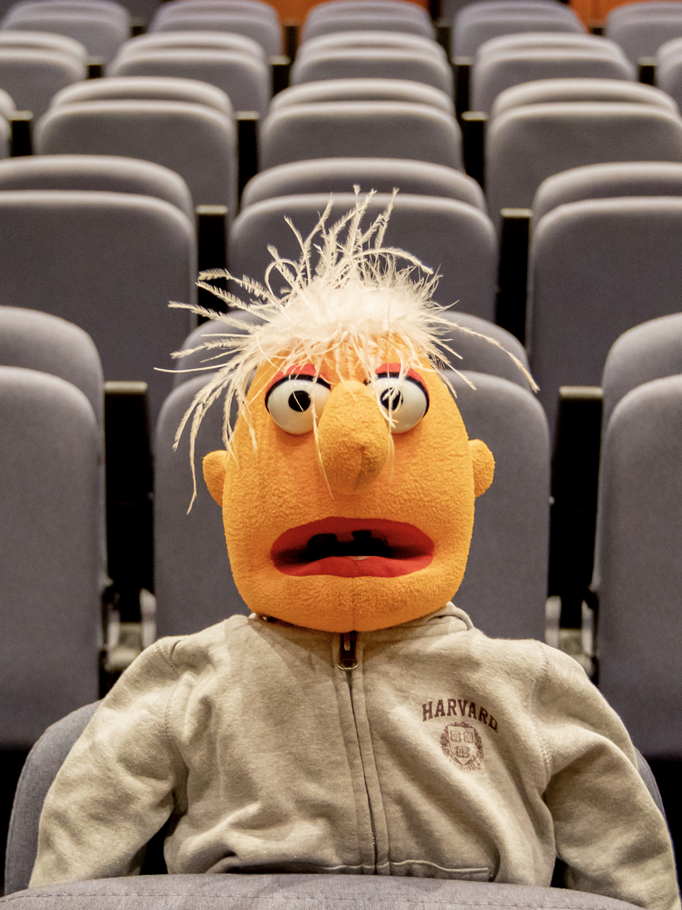
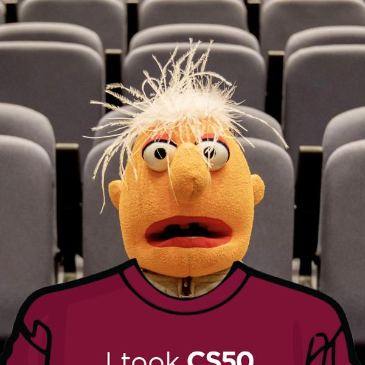
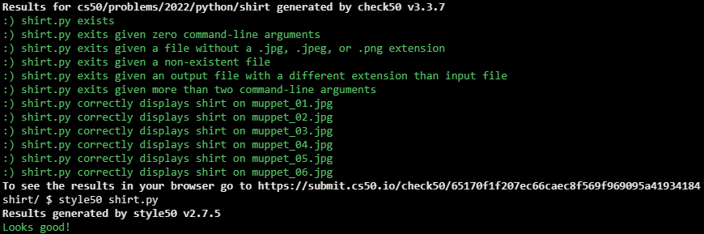

# CS50 P-Shirt

## Problem Description

After finishing CS50 itself, students on campus at Harvard traditionally receive their very own I took CS50 t-shirt. No need to buy one online, but like to try one on virtually?

In a file called shirt.py, implement a program that expects exactly two command-line arguments:

- in sys.argv[1], the name (or path) of a JPEG or PNG to read (i.e., open) as input
- in sys.argv[2], the name (or path) of a JPEG or PNG to write (i.e., save) as output

The program should then overlay shirt.png (which has a transparent background) on the input after resizing and cropping the input to be the same size, saving the result as its output.

Open the input with Image.open, per pillow.readthedocs.io/en/stable/reference/Image.html#PIL.Image.open, resize and crop the input with ImageOps.fit, per pillow.readthedocs.io/en/stable/reference/ImageOps.html#PIL.ImageOps.fit, using default values for method, bleed, and centering, overlay the shirt with Image.paste, per pillow.readthedocs.io/en/stable/reference/Image.html#PIL.Image.Image.paste, and save the result with Image.save, per pillow.readthedocs.io/en/stable/reference/Image.html#PIL.Image.Image.save.

The program should instead exit via sys.exit:

- if the user does not specify exactly two command-line arguments,
- if the input’s and output’s names do not end in .jpg, .jpeg, or .png, case-insensitively,
- if the input’s name does not have the same extension as the output’s name, or
- if the specified input does not exist.
Assume that the input will be a photo of someone posing in just the right way, like these demos, so that, when they’re resized and cropped, the shirt appears to fit perfectly.

If you’d like to run your program on a photo of yourself, first drag the photo over to VS Code’s file explorer, into the same folder as shirt.py. No need to submit any photos with your code. But, if you would like, you’re welcome (but not expected) to share a photo of yourself wearing your virtual shirt in any of CS50’s communities!

## My solution

### Description

#### scourgify.py

```python
import sys
import os

from PIL import Image, ImageOps


def main():
    # Validates proper amount of command-line arguments (3)
    args = len(sys.argv)
    if args < 3:
        sys.exit("ERROR: Too few command-line arguments")
    if args > 3:
        sys.exit("ERROR: Too many command-line arguments")

    # Validate image files
    input, output = valid_img_files(sys.argv)

    shirtify(input, output)


def valid_img_files(argv):
    """Validates both image files"""
    input = argv[1]
    output = argv[2]

    # Validates input exists
    if not os.path.isfile(input):
        sys.exit("ERROR: Input file does not exist")

    # Validates file extensions
    ext1 = input.split('.')[-1].lower()
    ext2 = output.split('.')[-1].lower()

    if ext1 not in ['jpg', 'jpeg', 'png']:
        sys.exit("ERROR: Input file is not an image")
    if ext2 not in ['jpg', 'jpeg', 'png']:
        sys.exit("ERROR: Output file's format is not a valid image one")
    if ext1 != ext2:
        sys.exit("ERROR: Image formats aren't compatible, must be the same")

    # Valid files
    return input, output


def shirtify(input, output):
    """Superimposes a shirt on input and saves it at output"""
    with Image.open(input) as base:
        shirt = Image.open('shirt.png')
        size = shirt.size

        image = ImageOps.fit(base, size)
        image.paste(shirt, shirt)
        image.save(output)


if __name__ == '__main__':
    main()
```

## Input



## Output



## Score



## Usage

1. Run 'pytest shirt.py *before after* on your command-line.