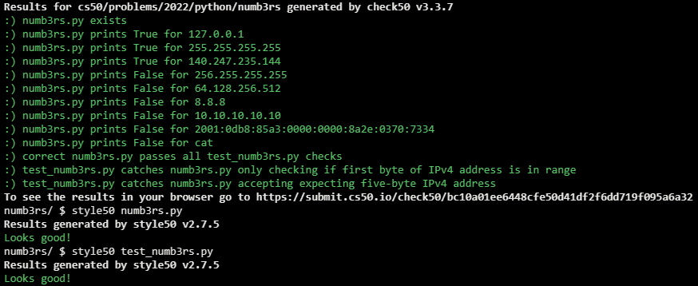

# NUMB3RS

## Problem Description

In Season 5, Episode 23 of NUMB3RS, a supposed IP address appears on screen, 275.3.6.28, which isn’t actually a valid IPv4 (or IPv6) address.

An IPv4 address is a numeric identifier that a device (or, on TV, hacker) uses to communicate on the internet, akin to a postal address in the real world, typically formatted in dot-decimal notation as #.#.#.#. But each # should be a number between 0 and 255, inclusive. Suffice it to say 275 is not in that range! If only NUMB3RS had validated the address in that scene!

In a file called numb3rs.py, implement a function called validate that expects an IPv4 address as input as a str and then returns True or False, respectively, if that input is a valid IPv4 address or not.

Structure numb3rs.py as follows, wherein you’re welcome to modify main and/or implement other functions as you see fit, but you may not import any other libraries. You’re welcome, but not required, to use re and/or sys.

```python
import re
import sys


def main():
    print(validate(input("IPv4 Address: ")))


def validate(ip):
    ...


...


if __name__ == "__main__":
    main()
```

Either before or after you implement validate in numb3rs.py, additionally implement, in a file called test_numb3rs.py, two or more functions that collectively test your implementation of validate thoroughly, each of whose names should begin with test_ so that you can execute your tests with:

```
pytest test_numb3rs.py
```

## My solution

#### numb3rs.py

```python
import re

def validate(ip):
    """Validates a given IP"""

    # Validates format
    if matches := re.fullmatch(r'(\d{1,3})\.(\d{1,3})\.(\d{1,3})\.(\d{1,3})', ip):

        # Validates range of each byte on the address
        for match in matches.groups():
            if int(match) not in range(256):
                return False
        return True
    else:
        return False
```

#### test_numb3rs.py

```python
from numb3rs import validate


# Too few bytes
def test_few_bytes():
    assert validate('0.0.0') == False


# Too many bytes
def test_many_bytes():
    assert validate('0.0.0.0.0') == False


# 4 bytes with the wrong format
def test_wrong_format():
    assert validate('0_0_0_0') == False
    assert validate('0/0/0/0') == False
    assert validate('0,0,0,0') == False
    assert validate('0. 0. 0. 0') == False


# Any of the bytes is out of range
def test_out_range():
    assert validate('-1.0.0.0') == False
    assert validate('0.-1.0.0') == False
    assert validate('0.0.-1.0') == False
    assert validate('0.0.0.-1') == False

    assert validate('256.0.0.0') == False
    assert validate('0.256.0.0') == False
    assert validate('0.0.256.0') == False
    assert validate('0.0.0.256') == False


# Valid IP
def test_valid_ip():
    assert validate('0.0.0.0') == True
    assert validate('255.255.255.255') == True
```

## Tests


## Score



## Usage

1. Run 'python numb3rs.py' and follow the prompt.