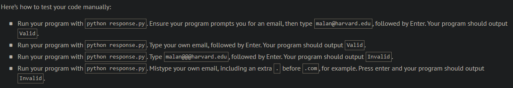

# Working 9 to 5

## Problem Description

When creating a Google Form that prompts users for a short answer (or paragraph), it’s possible to enable response validation and require that the user’s input match a regular expression. For instance, you could require that a user input an email address with a regex like this one:

```
^[a-zA-Z0-9.!#$%&'*+\/=?^_`{|}~-]+@[a-zA-Z0-9](?:[a-zA-Z0-9-]{0,61}[a-zA-Z0-9])?(?:\.[a-zA-Z0-9](?:[a-zA-Z0-9-]{0,61}[a-zA-Z0-9])?)*$
```

Or you could more easily use Google’s built-in support for validating an email address, per the screenshot below, much like you could use a library in your own code:


## My solution

#### response.py

```python
import validators


def main():
    if validators.email(input("What's your email address? ")):
        print('Valid')
    else:
        print('Invalid')
```

## Output Expected



## Output Obtained


## Score


## Usage

1. Run 'python response.py' and follow the prompt.