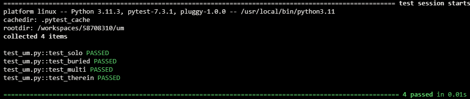
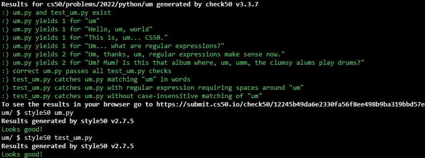

# Working 9 to 5

## Problem Description

It’s not uncommon, in English, at least, to say “um” when trying to, um, think of a word. The more you do it, though, the more noticeable it tends to be!

In a file called um.py, implement a function called count that expects a line of text as input as a str and returns, as an int, the number of times that “um” appears in that text, case-insensitively, as a word unto itself, not as a substring of some other word. For instance, given text like hello, um, world, the function should return 1. Given text like yummy, though, the function should return 0.

Structure um.py as follows, wherein you’re welcome to modify main and/or implement other functions as you see fit, but you may not import any other libraries. You’re welcome, but not required, to use re and/or sys.

```python
import re
import sys


def main():
    print(count(input("Text: ")))


def count(s):
    ...


...


if __name__ == "__main__":
    main()
```

Either before or after you implement count in um.py, additionally implement, in a file called test_um.py, three or more functions that collectively test your implementation of count thoroughly, each of whose names should begin with test_ so that you can execute your tests with:

```
pytest test_um.py
```

## My solution

#### um.py

```python
def count(s):
    """returns 'um' occurrances on s"""
    matches = re.findall(r'(?<!\w)um(?!\w)', s, flags=re.IGNORECASE)
    return len(matches)
```

#### test_um.py

```python
from um import count


# A single 'um'
def test_solo():
    assert count("um") == 1


# 'um' lost in a text
def test_buried():
    assert count("I don't know, um, what to say") == 1


# Multiple 'um's, different cases
def test_multi():
    assert count("Um, thanks, um...") == 2


# Um as part of a word
def test_therein():
    assert count("umbrella") == 0
```

## Tests



## Score



## Usage

1. Run 'python um.py' and follow the prompt.