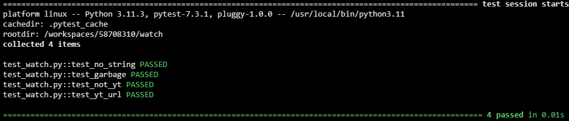
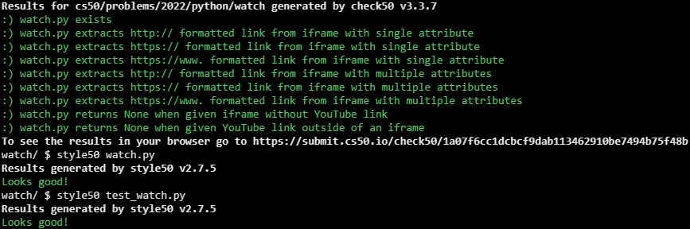

# Watch on Youtube

## Problem Description

It turns out that (most) YouTube videos can be embedded in other websites, just like the above. For instance, if you visit https://youtu.be/xvFZjo5PgG0 on a laptop or desktop, click Share, and then click Embed, you’ll see HTML (the language in which web pages are written) like the below, which you could then copy into your own website’s source code, wherein iframe is an HTML “element,” and src is one of several HTML “attributes” therein, the value of which, between quotes, is https://www.youtube.com/embed/xvFZjo5PgG0.

```
<iframe width="560" height="315" src="https://www.youtube.com/embed/xvFZjo5PgG0" title="YouTube video player" frameborder="0" allow="accelerometer; autoplay; clipboard-write; encrypted-media; gyroscope; picture-in-picture" allowfullscreen></iframe>
```

Because some HTML attributes are optional, you could instead minimally embed just the below.

```
<iframe src="https://www.youtube.com/embed/xvFZjo5PgG0"></iframe>
```

Suppose that you’d like to extract the URLs of YouTube videos that are embedded in pages (e.g., https://www.youtube.com/embed/xvFZjo5PgG0), converting them back to shorter, shareable youtu.be URLs (e.g., https://youtu.be/xvFZjo5PgG0) where they can be watched on YouTube itself.

In a file called watch.py, implement a function called parse that expects a str of HTML as input, extracts any YouTube URL that’s the value of a src attribute of an iframe element therein, and returns its shorter, shareable youtu.be equivalent as a str. Expect that any such URL will be in one of the formats below. Assume that the value of src will be surrounded by double quotes. And assume that the input will contain no more than one such URL. If the input does not contain any such URL at all, return None.

- http://youtube.com/embed/xvFZjo5PgG0
- https://youtube.com/embed/xvFZjo5PgG0
- https://www.youtube.com/embed/xvFZjo5PgG0

Structure watch.py as follows, wherein you’re welcome to modify main and/or implement other functions as you see fit, but you may not import any other libraries. You’re welcome, but not required, to use re and/or sys.

```python
import re
import sys


def main():
    print(parse(input("HTML: ")))


def parse(s):
    ...


...


if __name__ == "__main__":
    main()
```

## My solution

#### watch.py

```python
def parse(s):
    """Extract youtube url from 's' and returns it shortened"""
    if url := re.search(r'src="https?:\/\/(?:www.)?youtube.com\/embed\/(.+?)"', s):
        return f'https://youtu.be/{url.groups(1)[0]}'
```

#### test_watch.py

```python
from watch import parse


# Empty string
def test_no_string():
    assert parse('') == None


# Garbage string
def test_garbage():
    assert parse('Nlia3oM2XMs1FpCP5pvW') == None


# iframe but no youtube link within
def test_not_yt():
    assert parse('''<iframe width="560" height="315" src="https://www.twitch.tv/embed/xvFZjo5PgG0"
                 title="YouTube video player" frameborder="0" allow="accelerometer; autoplay; clipboard-write;
                 encrypted-media; gyroscope; picture-in-picture" allowfullscreen></iframe>''') == None


# iframe with youtube link within
def test_yt_url():
    assert parse('''<iframe width="560" height="315" src="https://www.youtube.com/embed/xvFZjo5PgG0"
                 title="YouTube video player" frameborder="0" allow="accelerometer; autoplay; clipboard-write;
                 encrypted-media; gyroscope; picture-in-picture" allowfullscreen></iframe>''') == 'https://youtu.be/xvFZjo5PgG0'
```

## Tests



## Score



## Usage

1. Run 'python watch.py' and follow the prompt.