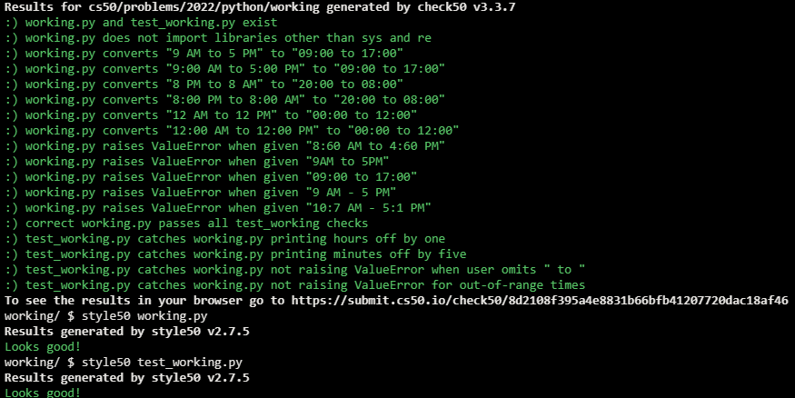

# Working 9 to 5

## Problem Description

Whereas most countries use a 24-hour clock, the United States tends to use a 12-hour clock. Accordingly, instead of “09:00 to 17:00”, many Americans would say they work “9:00 AM to 5:00 PM” (or “9 AM to 5 PM”), wherein “AM” is an abbreviation for “ante meridiem” and “PM” is an abbreviation for “post meridiem”, wherein “meridiem” means midday (i.e., noon).

In a file called working.py, implement a function called convert that expects a str in either of the 12-hour formats below and returns the corresponding str in 24-hour format (i.e., 9:00 to 17:00). Expect that AM and PM will be capitalized (with no periods therein) and that there will be a space before each. Assume that these times are representative of actual times, not necessarily 9:00 AM and 5:00 PM specifically.

9:00 AM to 5:00 PM
9 AM to 5 PM
Raise a ValueError instead if the input to convert is not in either of those formats or if either time is invalid (e.g., 12:60 AM, 13:00 PM, etc.). But do not assume that someone’s hours will start ante meridiem and end post meridiem; someone might work late and even long hours (e.g., 5:00 PM to 9:00 AM).

Structure working.py as follows, wherein you’re welcome to modify main and/or implement other functions as you see fit, but you may not import any other libraries. You’re welcome, but not required, to use re and/or sys.

```python
import re
import sys


def main():
    print(convert(input("Hours: ")))


def convert(s):
    ...


...


if __name__ == "__main__":
    main()
```

Either before or after you implement convert in working.py, additionally implement, in a file called test_working.py, three or more functions that collectively test your implementation of convert thoroughly, each of whose names should begin with test_ so that you can execute your tests with:

```
pytest test_working.py
```

## My solution

#### working.py

```python
import re


def main():
    print(convert(input("Hours: ")))


def convert(s):
    """Prints s back as a 24-hour formatted string"""
    matches = re.fullmatch(
        r"(?P<start_h>\d?\d)(?::(?P<start_m>\d\d) | )(?P<start_md>AM|PM) to (?P<end_h>\d?\d)(?::(?P<end_m>\d\d) | )(?P<end_md>AM|PM)", s)

    # Wrong input format
    if not matches:
        raise ValueError("Wrong input format")

    # Assigns match groups to local variables
    start_h = matches.group('start_h')
    start_m = matches.group('start_m')
    start_md = matches.group('start_md')

    # Adds minutes if missing
    if start_m == None:
        start_m = '00'

    end_h = matches.group('end_h')
    end_m = matches.group('end_m')
    end_md = matches.group('end_md')

    # Adds minutes if missing
    if end_m == None:
        end_m = '00'

    # Validates time range
    if not valid_time(start_h, start_m):
        raise ValueError("Start time is not valid.")
    if not valid_time(end_h, end_m):
        raise ValueError("End time is not valid.")

    return f"{fix_time(start_h, start_m, start_md)} to {fix_time(end_h, end_m, end_md)}"


def valid_time(h, m):
    """Validates both the hour and minutes range"""
    if int(h) not in range(13) or int(m) not in range(60):
        return False
    return True


def fix_time(hour, mins, md):
    """Turns hour from 12-hours format to 24-hours"""
    hour = int(hour)

    # After mid-day but not 12 PM
    if md == 'PM' and hour != 12:
        hour = hour + 12

    if hour < 10:
        hour = f'0{str(hour)}'
    elif hour == 12 and md == 'AM':
        hour = '00'
    else:
        hour = str(hour)
    return f'{hour}:{mins}'


if __name__ == "__main__":
    main()
```

#### test_working.py

```python
from working import convert, fix_time, valid_time
from pytest import raises


# Hour out of range
def test_invalid_hour():
    assert valid_time('-1', '00') == False
    assert valid_time('13', '00') == False


def test_invalid_hour_2():
    with raises(ValueError):
        convert("13 AM to 5 PM")


# Minutes our of range
def test_invalid_mins():
    assert valid_time('00', '-1') == False
    assert valid_time('00', '60') == False


def test_invalid_mins_2():
    with raises(ValueError):
        convert("9 AM to 4:60 PM")


# Valid time
def test_valid_time():
    assert valid_time('00', '00') == True
    assert valid_time('12', '59') == True


# Time reformatting
def test_fix_time():
    assert fix_time('12', '00', 'AM') == '00:00'
    assert fix_time('11', '59', 'AM') == '11:59'
    assert fix_time('12', '00', 'PM') == '12:00'
    assert fix_time('11', '59', 'PM') == '23:59'
    assert fix_time('9', '00', 'AM') == '09:00'


# Wrong input format
def test_wrong_format():
    with raises(ValueError):
        convert('From 9 AM to 5 PM')


def test_wrong_format_2():
    with raises(ValueError):
        convert('9 AM - 5 PM')


# Proper usage
def test_proper():
    assert convert('9 AM to 5 PM') == '09:00 to 17:00'
    assert convert('9 PM to 5 AM') == '21:00 to 05:00'
```

## Tests


## Score



## Usage

1. Run 'python working.py' and follow the prompt.