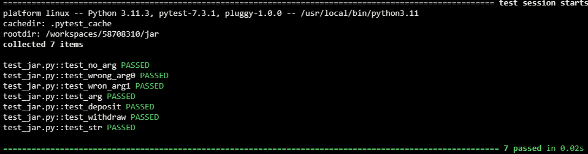
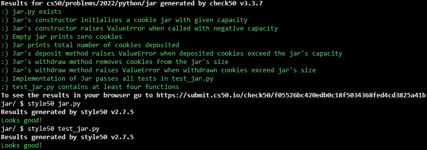

# Cookie Jar

## Problem Description

Suppose that you’d like to implement a cookie jar in which to store cookies. In a file called jar.py, implement a class called Jar with these methods:

- __init__ should initialize a cookie jar with the given capacity, which represents the maximum number of cookies that can fit in the cookie jar. If capacity is not a non-negative int, though, __init__ should instead raise a ValueError.
- __str__ should return a str with 
 🍪, where 
 is the number of cookies in the cookie jar. For instance, if there are 3 cookies in the cookie jar, then str should return "🍪🍪🍪"
- deposit should add n cookies to the cookie jar. If adding that many would exceed the cookie jar’s capacity, though, deposit should instead raise a ValueError.
- withdraw should remove n cookies from the cookie jar. Nom nom nom. If there aren’t that many cookies in the cookie jar, though, withdraw should instead raise a ValueError.
- capacity should return the cookie jar’s capacity.
- size should return the number of cookies actually in the cookie jar.

Structure your class per the below. You may not alter these methods’ parameters, but you may add your own methods.

```python
class Jar:
    def __init__(self, capacity=12):
        ...

    def __str__(self):
        ...

    def deposit(self, n):
        ...

    def withdraw(self, n):
        ...

    @property
    def capacity(self):
        ...

    @property
    def size(self):
        ...

```

Either before or after you implement jar.py, additionally implement, in a file called test_jar.py, four or more functions that collectively test your implementation of Jar thoroughly, each of whose names should begin with test_ so that you can execute your tests with:

```
pytest test_jar.py
```

Note that it’s not as easy to test instance methods as it is to test functions alone, since instance methods sometimes manipulate the same “state” (i.e., instance variables). To test one method (e.g., withdraw), then, you might need to call another method first (e.g., deposit). But the method you call first might itself not be correct!

And so programmers sometimes mock (i.e., simulate) state when testing methods, as with Python’s own mock object library, so that you can call just the one method but modify the underlying state first, without calling the other method to do so.

For simplicity, though, no need to mock any state. Implement your tests as you normally would!

## My solution

#### jar.py

```python
class Jar:
    def __init__(self, capacity=12):
        self.size = 0
        self.capacity = capacity

    def __str__(self):
        """Prints cookies in jar as emojis"""
        return '🍪' * self.size

    def deposit(self, n):
        """Adds n cookies to jar"""
        if self.size + n <= self.capacity:
            self.size += n
        else:
            raise ValueError("Too many cookies")

    def withdraw(self, n):
        """Removes cookies from jar"""
        if self.size - n < 0:
            raise ValueError("There aren't that many cookies in the jar")
        self.size -= n

    @property
    def capacity(self):
        return self._capacity

    @capacity.setter
    def capacity(self, n):
        n = int(n)

        if n <= 0:
            raise ValueError("Wrong amount of cookies")

        self._capacity = n

    @property
    def size(self):
        return self._size

    @size.setter
    def size(self, n):
        self._size = n
```

#### test_jar.py

```python
from jar import Jar
from pytest import raises


# No arguments
def test_no_arg():
    jar = Jar()
    assert jar.capacity == 12
    assert jar.size == 0


# Non-numeric capacity
def test_wrong_arg0():
    with raises(ValueError):
        jar = Jar("test")


# Non-positive capacity
def test_wron_arg1():
    with raises(ValueError):
        jar = Jar(0)


# Proper usage
def test_arg():
    jar = Jar(5)
    assert jar.capacity == 5


# Add cookies
def test_deposit():
    jar = Jar()
    jar.deposit(5)
    assert jar.size == 5


# Take cookies
def test_withdraw():
    jar = Jar()
    jar.deposit(5)
    jar.withdraw(3)
    assert jar.size == 2


# Print cookies
def test_str(capsys):
    jar = Jar(5)
    jar.deposit(3)
    print(jar)
    capture = capsys.readouterr()
    assert capture.out == "🍪🍪🍪\n"
```

## Tests



## Score



## Usage

1. Run 'python jar.py' and follow the prompt.