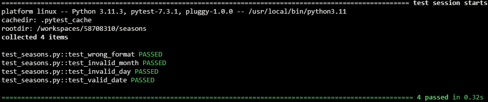
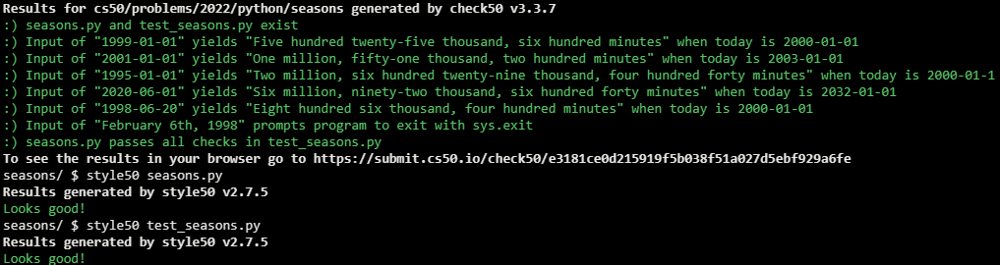

# Seasons of Love

## Problem Description

Assuming there are 365 days in a year, there are $365 * 24 * 60 = 525,600$ minutes in that same year (because there are 24 hours in a day and 60 minutes in an hour). But how many minutes are there in two or more years? Well, it depends on how many of those are leap years with 366 days, per the Gregorian calendar, as some of them could have $1 * 24 * 60 = 1,440$ additional minutes. In fact, how many minutes has it been since you were born? Well, that, too, depends on how many leap years there have been since! There is an algorithm for such, but let’s not reinvent that wheel. Let’s use a library instead. Fortunately, Python comes with a datetime module that has a class called date that can help, per docs.python.org/3/library/datetime.html#date-objects.

In a file called seasons.py, implement a program that prompts the user for their date of birth in YYYY-MM-DD format and then sings prints how old they are in minutes, rounded to the nearest integer, using English words instead of numerals, just like the song from Rent, without any and between words. Since a user might not know the time at which they were born, assume, for simplicity, that the user was born at midnight (i.e., 00:00:00) on that date. And assume that the current time is also midnight. In other words, even if the user runs the program at noon, assume that it’s actually midnight, on the same date. Use datetime.date.today to get today’s date, per docs.python.org/3/library/datetime.html#datetime.date.today.

Structure your program per the below, not only with a main function but also with one or more other functions as well:

```python
from datetime import date


def main():
    ...


...


if __name__ == "__main__":
    main()
```

You’re welcome to import other (built-in) libraries. Exit via sys.exit if the user does not input a date in YYYY-MM-DD format. Ensure that your program will not raise any exceptions.

Either before or after you implement seasons.py, additionally implement, in a file called test_seasons.py, one or more functions that test your implementation of any functions besides main in seasons.py thoroughly, each of whose names should begin with test_ so that you can execute your tests with:

```
pytest test_seasons.py
```

## My solution

#### seasons.py

```python
import re
import sys
import datetime
import inflect


def main():

    # Get valid birthdate from user
    bday = input("Date of Birth: ")
    bday = valid_date(bday)
    if not bday:
        sys.exit("Invalid date")

    # Today
    today = datetime.date.today()
    today = datetime.datetime(today.year, today.month, today.day, 0, 0, 0)

    # Time difference between today and the user's birthday, in minutes
    min_dif = today - bday
    min_dif = int(min_dif.total_seconds() // 60)

    # Inflect object
    p = inflect.engine()

    print(p.number_to_words(min_dif).replace(" and ", " ").capitalize() + " minutes")


def valid_date(date):
    """Validates date"""

    # Validate format
    match = re.fullmatch(r"(?P<year>\d{4})-(?P<month>\d{2})-(?P<day>\d{2})", date)
    if not match:
        return False

    # Validate month and day
    try:
        dt = datetime.datetime(int(match.group("year")), int(match.group("month")), int(match.group("day")), 0, 0, 0)
    except ValueError:
        return False

    return dt


if __name__ == "__main__":
    main()
```

#### test_seasons.py

```python
from um import count


# A single 'um'
def test_solo():
    assert count("um") == 1


# 'um' lost in a text
def test_buried():
    assert count("I don't know, um, what to say") == 1


# Multiple 'um's, different cases
def test_multi():
    assert count("Um, thanks, um...") == 2


# Um as part of a word
def test_therein():
    assert count("umbrella") == 0
```

## Tests



## Score



## Usage

1. Run 'python um.py' and follow the prompt.