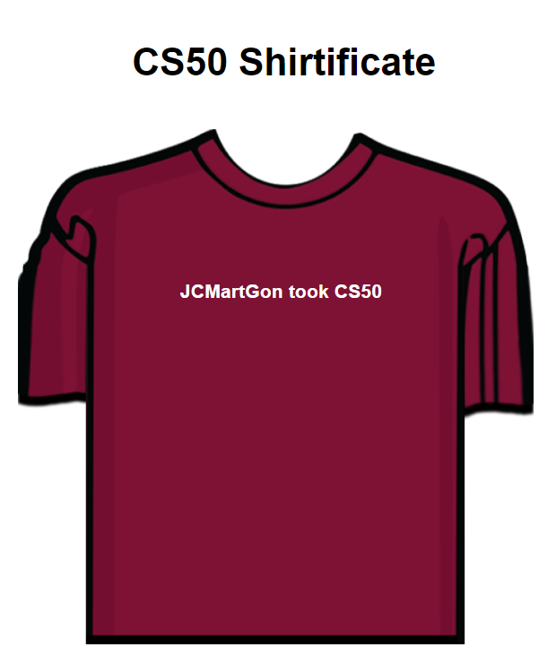
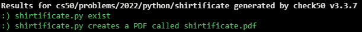

# CS50P Shirtificate

## Problem Description

Suppose that you’d like to implement a CS50 “shirtificate,” a PDF with an image of an I took CS50 t-shirt, shirtificate.png, customized with a user’s own name.

In a file called shirtificate.py, implement a program that prompts the user for their name and outputs, using fpdf2, a CS50 shirtificate in a file called shirtificate.pdf similar to this one for John Harvard, with these specifications:

The orientation of the PDF should be Portrait.
The format of the PDF should be A4, which is 210mm wide by 297mm tall.
The top of the PDF should say “CS50 Shirtificate” as text, centered horizontally.
The shirt’s image should be centered horizontally.
The user’s name should be on top of the shirt, in white text.

## My solution

#### shirtificate.py

```python
from fpdf import FPDF


def main():

    # Get name from user
    name = input("Name: ")

    # PDF's meta-data
    pdf = FPDF(orientation="P", unit="mm", format="A4")

    pdf.add_page()

    # Source image
    pdf.image('shirtificate.png', 8, 50, 190)

    # Title
    pdf.set_font('helvetica', 'B', size=40)
    pdf.text(50, 30, txt='CS50 Shirtificate')

    # Shirt's text
    pdf.set_font('helvetica', 'B', size=20)
    pdf.set_text_color(255)
    pdf.cell(190, 200, txt=f'{name} took CS50', align='C')

    # Output file
    pdf.output('shirtificate.pdf')


if __name__ == '__main__':
    main()
```

## Product



## Score



## Usage

1. Run 'python shirtificate.py' and follow the prompt.